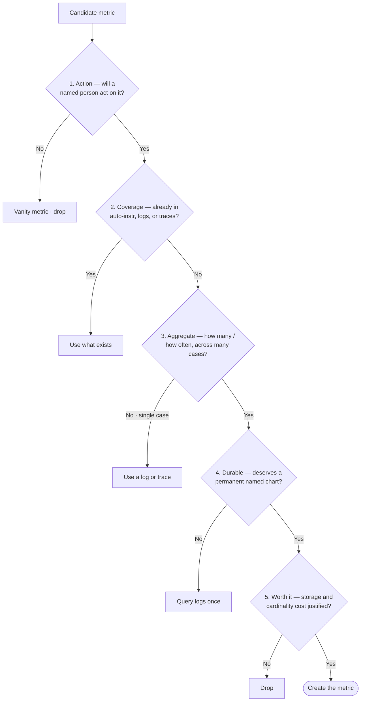
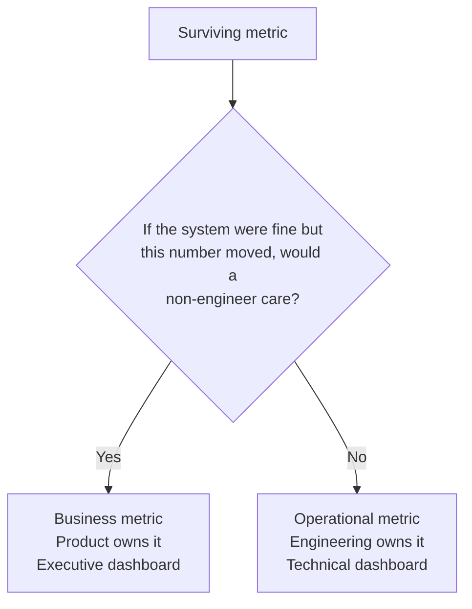

# From Green Dashboards to Guardrails: How Uncle Dev Builds Business Observability

In [part one](./observability-02.md), we watched a shoe store bleed money behind a 100% green dashboard. The lesson: stop measuring whether servers are awake, start measuring whether customers can actually buy shoes.

That's the easy part. Everyone nods along to "instrument the customer journey." Then they walk back to their desk and do the thing that feels like progress but quietly makes everything worse: they instrument everything. A metric on every function. A tag on every field. Six months later they have a $40,000 monitoring bill, 300 alerts a week, and no idea whether checkout is healthy.

Part two is about the other half of the problem: not why business observability matters, but how the **Uncle Dev** engineering skill actually builds it — the rules, the order of operations, and the guardrails that keep you from drowning.

The surprising part is where it starts. Uncle Dev doesn't open by telling you what to measure. It opens by talking you out of measuring.

## 1. The Default Answer Is "No"

Most observability advice is additive: here are ten more things to track. Uncle Dev inverts it. When you're about to add a custom metric, the default answer is no.

Why so stingy? Because you already get an enormous amount of telemetry for free. Your framework records how often each endpoint is hit, how often it fails, and how slow it is. Your logs already capture what happened in any single request. Your traces already show the path a request took through your services.

> **Jargon Buster: Auto-Instrumentation**
>
> - **Auto-Instrumentation:** Measurement your tools generate automatically, without you writing code — like a car that records its own speed, fuel level, and engine warnings without you wiring up a single sensor. In observability terms, this is "RED per endpoint" (Rate, Errors, Duration) and "USE per resource" (Utilization, Saturation, Errors).

So before any new metric is added, it has to prove it isn't already covered by something you're paying for anyway. A custom metric isn't a freebie. It's a long-term tenant: it costs money to store, it takes up space on dashboards people have to read, and every one you add makes the important numbers harder to find.

> **The Big Takeaway:** More metrics is not more visibility. Past a certain point it's less — the signal drowns in the noise. Uncle Dev treats every new metric as guilty until proven necessary.

## 2. The Five Gates: How a Metric Earns Its Place

A candidate metric has to pass five gates, in order. Fail any one and it doesn't become a metric. (That's not a failure. Most of the time, "no metric" is the correct outcome.)

| Gate             | The Question                                                           | If it fails…                                                       |
| ---------------- | ---------------------------------------------------------------------- | ------------------------------------------------------------------ |
| **1. Action**    | Will a named person change a decision based on this number?            | It's a vanity metric. Drop it.                                     |
| **2. Coverage**  | Is this already visible through auto-instrumentation, logs, or traces? | You already have it. Use that.                                     |
| **3. Aggregate** | Is the question "how many / how often / how fast" across many cases?   | It's a "why did THIS one fail?" question, which is a log or trace. |
| **4. Durable**   | Does this deserve a permanent, named chart — not a one-time look?      | A one-off curiosity. Query your logs once.                         |
| **5. Worth it**  | Is the ongoing storage and cardinality cost justified?                 | Drop it.                                                           |

Visually, the gates are a funnel — a candidate enters at the top and most candidates fall out before the bottom:



Gate 3 is where most teams go wrong, so it's worth making concrete.

Suppose you want to know "why did order #8421 fail at checkout?" That feels like something to monitor. But it's a question about one specific case, and answering it needs the order ID — a value that's different for every order. Turn that into a metric and you create millions of tiny separate measurements, one per order, and your bill explodes.

The right tool for "why did this one fail?" is a trace or a log, where looking at one case at a time is the whole point. A metric is for "how many orders failed this hour?" — the aggregate question.

> **The Big Takeaway:** Metrics answer "how many, how often, how fast." Logs and traces answer "what happened to this one." Forcing a single-case question into a metric is the number-one cause of surprise monitoring bills.

Uncle Dev also keeps a short list of places where a metric usually does earn its keep — calls to downstream APIs (success vs failure), important business events, auth failures, queue publishes, and the error conditions that trigger retries or compensating actions. These are candidates, not mandates. Each still has to pass all five gates.

## 3. Is It a Business Metric or a Plumbing Metric?

Say a metric makes it through the gates. Uncle Dev asks one more question, and it has a simple test:

> **The Litmus Test:** If the system were running fine but this number suddenly moved, would a non-engineer care?

- **Yes** → it's a **business metric**: payments captured, signups activated, orders placed. Product owns it. It goes on the executive dashboard.
- **No** → it's an **operational metric**: queue depth, retry counts, cache hit ratio. Engineering owns it. It goes on the technical dashboard.



This isn't bureaucratic labeling. It decides three real things: who owns the metric, which dashboard it lives on, and who gets paged when it breaks. A "payments dropped to zero" alert should wake up someone who can think about revenue. A "retry queue is backing up" alert should wake up an engineer. Mix them up and you page the wrong person at 3 AM.

Two more decisions come with every surviving metric:

- **What to measure.** Measure the outcome at the business-meaningful boundary, not the method call — `payment_captured` (confirmed), not `capture() invoked`. Then pick the instrument by the shape of the question: a **counter** for "how many," a **distribution** for "how long or how big" (read as percentiles), a **gauge** for "how many right now."
- **Which dimensions.** Add a way to slice the number only when someone will segment by it to make a decision, and you can name the comparison ("are we failing more on `provider=stripe` than `adyen`?"). Dimensions must be bounded and low-cardinality — never user IDs, emails, raw amounts, or free text. Those belong on logs and traces.

> **Jargon Buster: Dimensions (a.k.a. Tags)**
>
> - **Dimensions:** The ways you can slice a number — by region, by plan, by payment provider. Powerful, but each new slice multiplies the cost. Slicing by something unbounded like a user ID is the "cardinality bomb" from part one: it turns one metric into millions.

## 4. The Deliverable Is a Plan, Not Code

Here's the move that makes Uncle Dev unusual. When it decides a metric is warranted, it does not immediately write code to emit it.

Instead it produces a **Measurement Plan**: a plain, technology-agnostic description of what to measure and why. One small spec per metric:

```yaml
metric:
  name: payments_captured # domain language, not a code symbol
  kind: business # business | operational
  instrument: counter # counter | distribution | gauge
  question: "How many payments succeed, trending by provider and plan?"
  dimensions:
    - { name: provider, reason: "compare success across Stripe vs Adyen" }
    - { name: plan_tier, reason: "are paid customers hit harder?" }
  owner: payments-team
  dashboard_layer: executive # executive | engineering
  implementation: delegated
```

Notice what the spec carries: the name in plain domain language, whether it's business or operational, the exact question it answers, and a reason for every breakdown you want to slice it by.

Why a plan instead of code? Because the decision of what matters shouldn't be tangled up with the tool you happen to use today. Whether you emit this through OpenTelemetry, Prometheus, Datadog, or CloudWatch is a separate, swappable choice. The Measurement Plan survives a tool migration; emit code does not.

## 5. Then — and Only Then — the Seven Steps

Deciding which metrics deserve to exist is the gatekeeping half. The other half is wiring up a full customer journey end to end. Uncle Dev runs that as a strict seven-step sequence:

| Step               | What happens                                                                                                                |
| ------------------ | --------------------------------------------------------------------------------------------------------------------------- |
| **1. Journey**     | Pick one Critical User Journey (Checkout, Send Mail). Write it as objective → action → success condition.                   |
| **2. Instrument**  | Trace it across every service with OpenTelemetry, tagging each step with business context (`journey.name`, `journey.step`). |
| **3. SLO**         | Give each step an SLI, a target, and an error budget.                                                                       |
| **4. Criticality** | Spend the telemetry budget where revenue lives; go light everywhere else.                                                   |
| **5. Dashboard**   | Two linked layers: business view on top, engineering view one click beneath.                                                |
| **6. Alert**       | Alert on burn rate, with business context attached.                                                                         |
| **7. Loop**        | After every incident, prove the instrumentation caught it — or file the gap.                                                |

The single most important rule: do one journey completely before starting the next. A half-instrumented checkout flow is worse than none, because it hands you false confidence. You think you're watching the money path; you're watching half of it.

A couple of details that matter in steps 2 and 3:

- **Propagate one trace, don't start new ones.** The context has to flow from gateway to services to datastore on a single trace ID. A fresh trace per service gives you disconnected spans and destroys the end-to-end view. On the journey span you attach low-cardinality business attributes — `customer.tier`, `cart.value_bucket` (bucketed, never the raw amount).
- **Read percentiles, not averages.** Track latency as a histogram and watch P95/P99. Averages hide the slow tail that actually drives cart abandonment.

> **Jargon Buster: Error Budget**
>
> - **Error Budget:** The small amount of failure you're allowed before breaking your promise. Promise checkout works 99.9% of the time over 30 days and your budget is about **43 minutes** of failure that month. Budget healthy? Ship features. Budget burning? Stop and stabilize. It turns "is reliability OK?" from an argument into arithmetic.

One sobering bit of math from the SLO step: a service is never more reliable than the product of its hard dependencies. Chain three services at 99.9% each and your ceiling is roughly 99.7%. You can't promise more reliability than your dependencies give you.

## 6. Alert on the Fire, Not the Smoke-Detector Battery

Step 6 is where part one's promise — alert me that customers are frustrated, not that a database is lagging — gets built.

Traditional alerts fire on causes: CPU over 80%. The problem is that CPU spikes constantly without anyone caring, so engineers learn to ignore the alerts. Alert fatigue, again.

Uncle Dev alerts on **burn rate** instead — the speed at which you're eating your error budget — and it requires two time windows to agree before it pages anyone:

- A **short window** so it reacts fast when something genuinely breaks.
- A **long window** so a brief blip doesn't set off the siren.

In practice that's two tiers. Fast burn — roughly 2% of the budget in an hour — pages someone. Slow burn — about 10% over three days — files a ticket. Two severities, no more.

And every alert carries the business translation. Not "PaymentService 500s elevated on host-7," but "Checkout error budget burning — ~$X/min at risk," with a link to the runbook that tells the on-call engineer what to do.

> **The Big Takeaway:** Page humans for symptoms customers feel, never for internal causes. If a cause is bad enough to matter, it shows up as a symptom. If it never shows up as a symptom, it never deserved a page.

## 7. Uncle Dev Decides What; A Companion Builds How

There's one last piece of the design, and it's what keeps everything above honest.

Uncle Dev draws a hard line. It owns the thinking — what to measure, why, business or operational, which dimensions. It refuses to own the typing — the specific library, the SDK calls, the naming conventions of your telemetry tool.

That second job goes to a **companion** skill, configured per project. If your stack is CloudWatch, a CloudWatch companion takes each metric spec and turns it into real emit code, respecting that tool's dimension limits and quirks. If no companion is configured, Uncle Dev delivers the Measurement Plan and stops. It will never guess a telemetry library and start writing code you didn't ask for — you wire up a companion with `/uncle-dev-custom-me` first.

This separation is the whole philosophy in miniature. The expensive, durable decision is "what's worth measuring." The cheap, swappable decision is "which tool emits it." Keep them apart and you can change vendors without re-litigating what your business cares about.

## 8. Where This Lives in the Real Workflow

None of this is a separate "observability project" that happens after launch. Uncle Dev folds it into how features get built:

- **During spec:** for each thing the feature must do, run the five gates. Most acceptance criteria produce zero metrics, and that's the expected outcome. The few that survive become the Measurement Plan.
- **During planning:** each surviving metric becomes one instrumentation task with a clear owner.
- **During build:** the companion emits it, and then you verify it actually answers the question it promised to.
- **After every incident:** you check whether the instrumentation caught the problem and pointed at the cause. If it didn't, the missing span attribute, SLI, or alert becomes the next backlog item.

That last loop is the engine. Every outage either confirms your observability works or hands you the exact gap to fix. Over time your monitoring stops being a wall of guesses and becomes a map of the things that have actually hurt you.

## Final Thoughts: Discipline Is the Feature

Part one argued that your servers don't pay the bills — your customers do. Part two is about the discipline that turns that belief into a system you can run.

And the discipline is mostly restraint. Default to no metric. Make each one earn its place through five gates. Separate what's worth knowing from how you happen to record it. Instrument one journey completely before touching the next. Page humans only for pain a customer can feel.

It's tempting to measure everything, because measuring feels like caring. But a dashboard with 500 numbers tells you nothing, and a $40,000 bill for it tells you something worse. The teams that catch the silent checkout outage aren't the ones watching the most metrics. They're the ones watching the right ones — and Uncle Dev's whole job is making that a deliberate choice, every time.
