# OPERATING MODEL
## Spec-Driven Development + MCP (Enterprise Model)

> **Version:** 3.0 — February 2026
>
> **Core Principle:** *"Nothing is implemented without a validated spec backed by governed context."*

---

# 1) FORMAL OPERATING MODEL

## 1.0 Methodology Origins — What We Took and Why

SDD v3.0 is a deliberate composition of proven frameworks, not a new methodology invented from scratch. Every practice was adopted against a single filter: *"Does this change what the agent or engineer writes? If not, it is eliminated."*

Three frameworks contributed the core structural ideas. Their specific contributions — and the rationale behind each adoption — are documented here for any team member who needs to understand, challenge, or evolve the model.

---

### BMAD — Breakthrough Method for Agile AI Development

BMAD defines the AI-native multi-agent workflow architecture. These practices were adopted directly:

**1. Four bounded agent roles (analyst · architect · developer · verifier)**
Each agent has a single, non-overlapping responsibility. An agent never does another agent's job. The analyst produces only `discovery.md`. The architect produces only `feature-spec.md` and `component-spec.md`. The developer produces only `impl-spec.md` and `tasks.yaml`. The verifier produces only `verify.md`.

*Rationale:* Role-scoped agents prevent context overreach. When an agent writes outside its bounded role, it invents context it doesn't have the right MCP sources for. Strict role separation means each agent calls only the tools it actually needs and produces outputs that are predictable, auditable, and attributable.

**2. Sequential handoff with hard stops**
Each agent completes its exit gate checklist before the next agent starts. The Verifier is a hard stop — no merge is possible until every AC has observable evidence.

*Rationale:* Hard stops at each handoff make quality gates enforceable without an external validator service. The agent itself is the gate. Removing the hard stop turns the gate into a suggestion.

**3. Parallel fan-out from Architect to Developer agents**
Once `feature-spec.md` is approved, one Developer agent runs per affected component simultaneously. The Verifier waits for all to complete before producing `verify.md`.

*Rationale:* Sequential Developer execution is the primary bottleneck in cross-domain features. Components that don't depend on each other can be built concurrently. Fan-out maintains full traceability — every Developer instance writes against the same approved `feature-spec.md`.

**4. Agent definitions as Markdown files in `.claude/agents/`**
Each agent is a `.md` file loaded on demand. Behaviour is expressed in text, not code.

*Rationale:* The team can evolve agent behaviour via PR without a deployment. The update path for agents is identical to the update path for specs and templates — a PR that gets reviewed, merged, and immediately effective.

*What we dropped from BMAD:*
- Orchestrator agent (meta-agent routing to specialists) → replaced by `Platform MCP.get_workflow(risk_level)`. The Platform MCP determines which agents to activate based on risk level. A separate routing agent is unnecessary.
- Persona-based agent naming ("Alex the Architect") → role names are sufficient. Persona framing doesn't change what gets written.

---

### OpenSpec — Open Specification Format

OpenSpec defines the structured spec format for distributed systems. These practices were adopted:

**1. Mandatory traceability metadata on every spec**
Every spec must declare: `implements` (parent spec ID + version), `context_pack` (the versioned snapshot used when the spec was authored), `blocked_by` (open ADR IDs preventing implementation), and `status` (Draft / Approved / Implementing / Done / Paused / Blocked).

*Rationale:* Without these fields, a spec is an island — you cannot tell what it is implementing, what context it was written against, or whether it is safe to act on. Without `context_pack`, a spec authored six months ago may be stale relative to current policies. Without `blocked_by`, the Developer might start implementing a spec that has an unresolved ambiguity.

**2. Spec Graph (`graph/index.yaml`)**
A machine-readable index linking every artifact in the chain: Initiative → feature-spec → component-specs → impl-specs → verify.md → ADRs. The Verifier updates this index after every merge.

*Rationale:* The Spec Graph is the audit trail. It answers "what was built, why, against what context, and was it verified?" — questions that are critical in post-incident analysis, compliance reviews, and when onboarding a new team member. Without the graph, the chain of causality is reconstructed from git blame and memory.

**3. MCP source citation per spec section**
Every section of a spec must declare its source: which MCP tool returned the content, which version.

*Rationale:* A spec section without a source is an assertion without evidence. Citing the source makes the spec verifiable, makes it easy to detect staleness when MCP content is updated, and prevents the gradual drift where agents copy forward old content without checking whether it is still valid.

**4. Specs are never deleted — only versioned**
Status transitions: Draft → Approved → Implementing → Done. Or → Paused (waiting on business priority), or → Blocked (waiting on ADR resolution). Paused specs preserve their `context_pack` version so they can be safely rebased on resumption.

*Rationale:* Deleted specs create invisible debt — they represent decisions that were made and then forgotten. A Paused spec with its context pack pinned can be rebased and resumed with full awareness of what has changed since it was written. A deleted spec is redone from scratch, without the benefit of prior decisions.

*What we dropped from OpenSpec:*
- Spec versioning server (dedicated service for spec diffs, conflict detection, branch-per-initiative spec trees) → git handles versioning, the Spec Graph handles links. No separate server.

---

### SpecKit — Template-Driven Spec Assembly

SpecKit defines the template-driven pattern for AI-assisted spec authoring. These practices were adopted:

**1. Templates with embedded exit gate checklists**
Spec templates are not blank forms. Each section of a template includes the self-verification checklist the agent must complete before handing off. The template and the gate are the same artifact.

*Rationale:* Separating "how to write the spec" from "how to verify the spec" creates a gap where quality degrades. If the gate is a separate document or process, it gets skipped. Embedding the gate in the template closes that gap — the agent writes and checks in one pass, and the checklist is always current with the template.

**2. Context Pack — versioned snapshot assembled before spec writing**
Before any spec is written, the agent calls Platform MCP to assemble a pinned snapshot of all applicable policies, NFR baselines, and workflow config for this intent. This snapshot is recorded as `context_pack` in the spec's metadata.

*Rationale:* Writing a spec against a moving context is the root cause of spec drift. Two agents writing specs two weeks apart against different platform policies will produce inconsistent specs, even if they follow the same template. Pinning the context pack version makes the spec reproducible — another agent reading the spec can retrieve the identical context and understand exactly what constraints were in effect.

**3. Template-driven spec types (four distinct templates)**
`feature-spec`, `component-spec`, `impl-spec`, and `verify.md` each have a dedicated template served by Platform MCP. Every instance of a spec type has the same structure.

*Rationale:* Uniform structure means agents, humans, and CI can parse and validate specs without special-casing. The Verifier knows exactly where to find ACs because every `component-spec` places them in the same section. CI knows exactly what fields to validate because the structure is consistent.

**4. Templates served by Platform MCP (`get_template(name)`)**
Templates are not stored locally with the agent. The agent calls Platform MCP at runtime to fetch the current template version.

*Rationale:* Template evolution is zero-friction. Update the template in the specs repo and every agent immediately gets the new version on the next call — no agent file changes, no deployment, no coordination required. If the exit gate checklist needs a new item, add it to the template and it applies to every spec written from that moment forward.

*What we dropped from SpecKit:*
- Spec scaffolding CLI (command-line tool generating stubs and validating structure at creation) → `Platform MCP.get_template()` replaces this inline. The agent fetches and fills the template in the same context window, no CLI needed.

---

## 1.1 Purpose

Define a **repeatable, auditable, and scalable system** to build software where:

- Knowledge is explicit (specs, ADRs, contracts)
- Context is governed (two MCP server types)
- Execution is traceable (Spec Graph)
- Humans and AI agents collaborate safely
- All process lives in Markdown — versionable, editable, zero overhead infrastructure

---

## 1.2 Core Principle

> **"Nothing is implemented without a validated spec backed by governed context."**

Agents — human or AI — do not invent context. They call MCP tools to get the truth. If a methodology component doesn't change what the agent writes, it's eliminated.

---

## 1.3 System Model

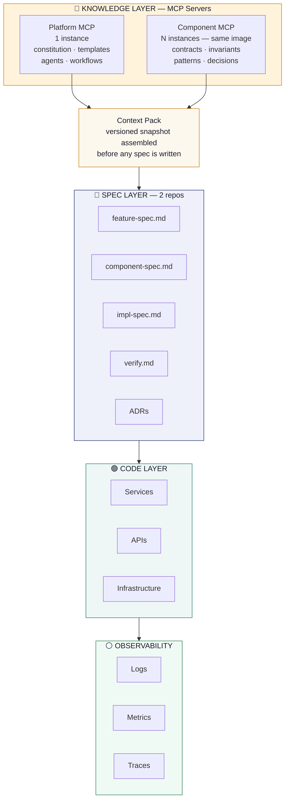

```
┌──────────────────────────────────────────────────────────────────────┐
│                    KNOWLEDGE LAYER  (MCP Servers)                    │
│                                                                      │
│  ┌───────────────────────────────┐  ┌──────────────────────────────┐ │
│  │  Platform MCP  (1 instance)   │  │  Component MCP  (N instances)│ │
│  │  constitution · templates     │  │  same image · diff config    │ │
│  │  agents · workflows           │  │  contracts · invariants      │ │
│  │                               │  │  patterns · decisions        │ │
│  └───────────────────────────────┘  └──────────────────────────────┘ │
└────────────────────────────┬─────────────────────────────────────────┘
                             │  Context Pack (versioned snapshot)
                             │  assembled before any spec is written
                             ▼
┌──────────────────────────────────────────────────────────────────────┐
│                      SPEC LAYER  (2 repos)                           │
│                                                                      │
│   feature-spec.md  ·  component-spec.md  ·  impl-spec.md            │
│   verify.md  ·  ADRs  ·  tasks.yaml                                  │
└────────────────────────────┬─────────────────────────────────────────┘
                             │  execution against approved,
                             │  gate-checked specs
                             ▼
┌──────────────────────────────────────────────────────────────────────┐
│                         CODE LAYER                                   │
│                  Services  ·  APIs  ·  Infrastructure                │
└────────────────────────────┬─────────────────────────────────────────┘
                             ▼
┌──────────────────────────────────────────────────────────────────────┐
│                        OBSERVABILITY                                 │
│                    Logs  ·  Metrics  ·  Traces                       │
└──────────────────────────────────────────────────────────────────────┘
```

---

## 1.4 Two-Repo Architecture

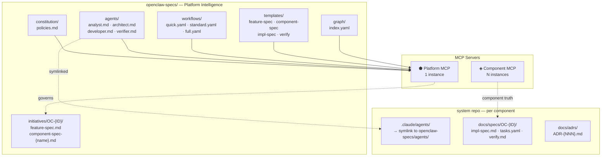

```
  openclaw-specs/  (Platform Intelligence)
  ┌──────────────────────────────────────────────┐
  │ constitution/                                │
  │   policies.md          ◄── Platform MCP reads│
  │ agents/                                      │
  │   analyst.md                                 │
  │   architect.md         ◄── symlinked into    │
  │   developer.md              .claude/agents/  │
  │   verifier.md                                │
  │ workflows/                                   │
  │   quick.yaml                                 │
  │   standard.yaml        ◄── Platform MCP reads│
  │   full.yaml                                  │
  │ templates/                                   │
  │   feature-spec.md                            │
  │   component-spec.md    ◄── Platform MCP reads│
  │   impl-spec.md                               │
  │ initiatives/OC-{ID}/                         │
  │   feature-spec.md      ◄── Architect produces│
  │   component-spec-*.md  ◄── Architect produces│
  │ graph/index.yaml       ◄── Verifier updates  │
  └──────────────────────────────────────────────┘

  system repo  (per component)
  ┌──────────────────────────────────────────────┐
  │ .claude/agents/                              │
  │   → symlink to openclaw-specs/agents/        │
  │ docs/specs/OC-{ID}/                          │
  │   impl-spec.md         ◄── Developer produces│
  │   tasks.yaml           ◄── Developer produces│
  │   verify.md            ◄── Verifier produces │
  │ docs/adrs/                                   │
  │   ADR-{NNN}.md         ◄── ADR Owner writes  │
  └──────────────────────────────────────────────┘

  MCP Servers
  ┌──────────────────────┐  ┌──────────────────────────┐
  │ Platform MCP         │  │ Component MCP            │
  │ 1 instance           │  │ N instances              │
  │ reads openclaw-specs/│  │ same image · diff config │
  └──────────────────────┘  └──────────────────────────┘
```

**Rule:** Component teams consume specs from `openclaw-specs/` as input. They PR to it, never edit it directly.

---

## 1.5 Two MCP Server Types

### Platform MCP — 1 instance per organisation

Reads `openclaw-specs/`. Never requires redeployment — update the specs repo, the MCP serves new knowledge immediately.

| Tool | Returns |
|---|---|
| `get_context_pack(intent)` | Risk level + applicable policies + workflow config |
| `get_template(name)` | Template with embedded exit gate checklist |
| `get_agent(name)` | Full agent definition (analyst/architect/developer/verifier) |
| `get_workflow(risk_level)` | Which agents to activate for this change |

### Component MCP — N instances (same image, different config)

One instance per component. Same Docker image, different environment config pointing to that component's specs directory.

| Tool | Returns |
|---|---|
| `get_contracts()` | NATS topics, HTTP endpoints, event schemas, consumer list |
| `get_invariants()` | Immutable business rules — cannot be violated |
| `get_patterns()` | Approved implementation patterns + canonical examples |
| `get_decisions()` | ADRs + prior technical decisions |

Component MCP instances are updated after each release via PR. The system gets smarter with each cycle.

---

## 1.6 Roles and Responsibilities

| Role | Repo | Owns | Accountable For |
|---|---|---|---|
| **Product Manager** | Platform | Initiative definition, business goals, UX intent | Initiative (Epic), success criteria |
| **Platform Architect** | Platform | `constitution/`, `templates/`, `workflows/`, `graph/index.yaml` | "What the system must do" · approves Architect agent output |
| **Domain Owner** | Platform + System | Component specs — invariants, contracts, patterns, ADRs | Domain correctness · approves Developer agent output |
| **Integration Owner** | Platform | `contracts/` inside each component spec | Approves contract changes at Architect exit gate |
| **Component Team** | System | `impl-spec.md`, code, tests, local ADRs | "How the system works locally" — Developer + Verifier agents |
| **ADR Owner** | Platform or Component | Technical decisions — global or local scope | Resolving ambiguity before implementation proceeds |
| **AI Agents** | Both | analyst · architect · developer · verifier | Must call MCPs · self-check exit gates · produce traceable outputs per risk level |

---

## 1.7 Artifacts

| Artifact | Location | Produced By | Purpose |
|---|---|---|---|
| **Initiative** | `openclaw-specs/initiatives/` | Product Manager | Why — business goal |
| **feature-spec.md** | `openclaw-specs/initiatives/OC-{ID}/` | Architect agent | What — UX, responsibilities, contract changes |
| **component-spec.md** | `openclaw-specs/initiatives/OC-{ID}/` | Architect agent | What — per-component ACs, NFRs, constraints |
| **impl-spec.md** | System repo `docs/specs/OC-{ID}/` | Developer agent | How — exact data model, code changes, edge cases |
| **tasks.yaml** | System repo `docs/specs/OC-{ID}/` | Developer agent | Execution — tasks with owner, points, dependencies |
| **verify.md** | System repo `docs/specs/OC-{ID}/` | Verifier agent | Evidence — AC verification, merge gate sign-off |
| **ADR** | Platform `/adrs/` or component `/adrs/` | ADR Owner | Decision — blocks dependent specs until approved |
| **Spec Graph** | `openclaw-specs/graph/index.yaml` | Verifier agent | Traceability — links all artifacts |
| **Constitution** | `openclaw-specs/constitution/policies.md` | Platform Architect | Governance — non-negotiable platform rules |

---

## 1.8 Development Lifecycle

### Three Workflows

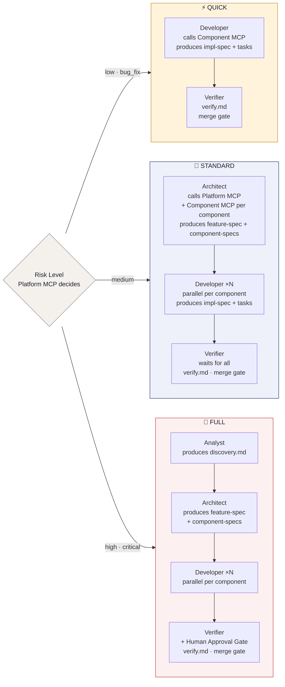

```
  Risk Level?  (Platform MCP decides)
       │
       ├─── low / bug_fix ───────────────────────────────────────────────────┐
       │                                                                     │
       │  QUICK                                                              │
       │  ┌────────────────────────────────────────────────────────────┐    │
       │  │ Developer                                                  │    │
       │  │ · calls Component MCP  (get_patterns, get_decisions)       │    │
       │  │ · produces impl-spec.md + tasks.yaml                       │    │
       │  └──────────────────────────────┬─────────────────────────────┘    │
       │                                 │                                  │
       │                                 ▼                                  │
       │  ┌─────────────────────────────────────────────────────────────┐   │
       │  │ Verifier  →  verify.md  →  merge gate                      │   │
       │  └─────────────────────────────────────────────────────────────┘   │
       │                                                                     │
       ├─── medium ──────────────────────────────────────────────────────────┤
       │                                                                     │
       │  STANDARD                                                           │
       │  ┌─────────────────────────────────────────────────────────────┐   │
       │  │ Architect                                                   │   │
       │  │ · calls Platform MCP  (get_context_pack, get_template)      │   │
       │  │ · calls Component MCP ×N  (contracts, invariants, decisions)│   │
       │  │ · produces feature-spec.md + component-spec.md ×N           │   │
       │  └──────────────────────────────┬──────────────────────────────┘   │
       │                                 │ fan-out                          │
       │          ┌──────────────────────┼──────────────────────┐           │
       │          ▼                      ▼                      ▼           │
       │   ┌─────────────┐       ┌─────────────┐       ┌─────────────┐     │
       │   │ Developer   │       │ Developer   │       │ Developer   │     │
       │   │ component A │       │ component B │       │ component N │     │
       │   └──────┬──────┘       └──────┬──────┘       └──────┬──────┘     │
       │          └──────────────────────┴──────────────────────┘           │
       │                                 │                                  │
       │                                 ▼                                  │
       │  ┌─────────────────────────────────────────────────────────────┐   │
       │  │ Verifier  (waits for all)  →  verify.md  →  merge gate      │   │
       │  └─────────────────────────────────────────────────────────────┘   │
       │                                                                     │
       └─── high / critical ────────────────────────────────────────────────┤
                                                                            │
          FULL                                                              │
          ┌──────────────────────────────────────────────────────────────┐  │
          │ Analyst  →  produces discovery.md                           │  │
          └───────────────────────────┬──────────────────────────────────┘  │
                                      │                                     │
          ┌───────────────────────────▼──────────────────────────────────┐  │
          │ Architect  →  feature-spec.md + component-spec.md ×N         │  │
          └───────────────────────────┬──────────────────────────────────┘  │
                                      │ fan-out                            │
                     ┌────────────────┼────────────────┐                   │
                     ▼                ▼                ▼                   │
              ┌─────────────┐  ┌─────────────┐  ┌─────────────┐           │
              │ Developer   │  │ Developer   │  │ Developer   │           │
              │ component A │  │ component B │  │ component N │           │
              └──────┬──────┘  └──────┬──────┘  └──────┬──────┘           │
                     └────────────────┴────────────────┘                   │
                                      │                                     │
          ┌───────────────────────────▼──────────────────────────────────┐  │
          │ Verifier + Human Approval Gate  →  verify.md  →  merge gate  │  │
          └──────────────────────────────────────────────────────────────┘  │
                                                                            ▼
                                                                      merge gate
```

### Full Lifecycle Sequence

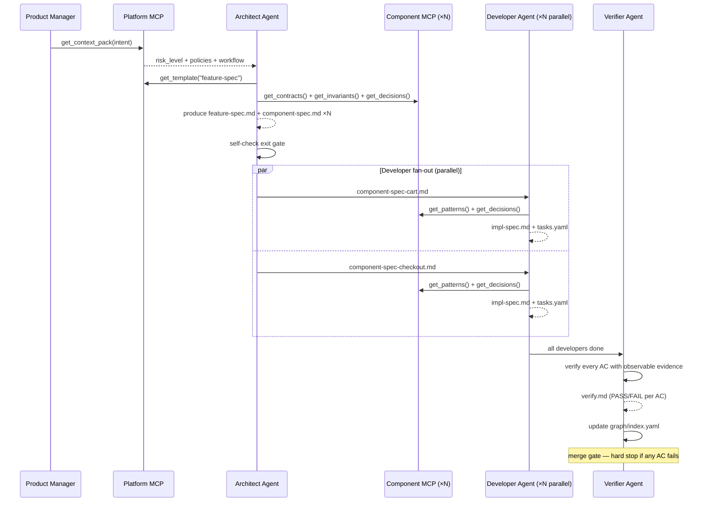

```
  Product      Platform     Architect    Component    Developer    Verifier
  Manager      MCP          Agent        MCP (×N)     Agent (×N)   Agent
     │            │             │             │             │          │
     │──get_context_pack(intent)►│             │             │          │
     │            │◄────────────┤             │             │          │
     │            │  risk_level │             │             │          │
     │            │  + policies │             │             │          │
     │            │  + workflow │             │             │          │
     │            │             │──get_template("feature-spec")        │
     │            │             │──get_contracts()──────────►│         │
     │            │             │──get_invariants()─────────►│         │
     │            │             │──get_decisions()──────────►│         │
     │            │             │◄────────────────────────────         │
     │            │             │  produce feature-spec.md             │
     │            │             │  + component-spec.md ×N              │
     │            │             │  self-check exit gate                │
     │            │             │                                      │
     │            │     ════════╪═══════ fan-out (parallel) ══════════ │
     │            │             │──component-spec-cart.md─────────────►│
     │            │             │             │◄──get_patterns()────── │
     │            │             │             │◄──get_decisions()───── │
     │            │             │             │   impl-spec + tasks ──►│
     │            │             │──component-spec-checkout.md─────────►│
     │            │             │             │◄──get_patterns()────── │
     │            │             │             │   impl-spec + tasks ──►│
     │            │     ════════╪══════════════════════════════════════ │
     │            │             │                                      │
     │            │             │         all developers done─────────►│
     │            │             │                            verify ACs│
     │            │             │                            verify.md │
     │            │             │                         graph update │
     │            │             │                         merge gate ◄─┘
     │            │             │                         (hard stop)
```

---

## 1.9 Four Agents

```mermaid
graph LR
    subgraph ANALYST["analyst.md — Discovery\nFull workflow only"]
        AN1["calls Platform MCP\nget_context_pack()"]
        AN2["interviews team\none question at a time"]
        AN3["produces discovery.md\nevidence-based · no assumptions"]
    end

    subgraph ARCHITECT["architect.md — Specification\nStandard + Full"]
        AC1["calls Platform MCP\nget_context_pack()\nget_template()"]
        AC2["calls Component MCP ×N\nget_contracts()\nget_invariants()\nget_decisions()"]
        AC3["produces feature-spec.md\n+ component-spec.md ×N"]
    end

    subgraph DEVELOPER["developer.md — Implementation\nAll workflows · parallel per component"]
        DV1["reads component-spec.md"]
        DV2["calls Component MCP\nget_patterns()\nget_decisions()"]
        DV3["produces impl-spec.md\n+ tasks.yaml"]
    end

    subgraph VERIFIER["verifier.md — Verification\nAll workflows · hard stop"]
        VR1["reads component-spec ACs\nreads impl-spec"]
        VR2["verifies every AC\nwith observable evidence"]
        VR3["produces verify.md\nupdates graph/index.yaml"]
    end

    ANALYST --> ARCHITECT --> DEVELOPER --> VERIFIER
```

```
  ┌───────────────────────┐   ┌───────────────────────┐
  │  analyst.md           │   │  architect.md          │
  │  FULL only            │   │  STANDARD + FULL       │
  │                       │   │                        │
  │  · calls Platform MCP │   │  · calls Platform MCP  │
  │    get_context_pack() │   │    get_context_pack()  │
  │  · interviews team    │──►│    get_template()      │
  │    one Q at a time    │   │  · calls Component MCP │
  │  · produces           │   │    ×N components:      │
  │    discovery.md       │   │    get_contracts()     │
  │    evidence-based     │   │    get_invariants()    │
  │    no assumptions     │   │    get_decisions()     │
  │                       │   │  · produces            │
  │  EXIT GATE            │   │    feature-spec.md     │
  │  · metric in problem  │   │    component-spec ×N   │
  │  · ≥1 real data point │   │                        │
  │  · affected components│   │  EXIT GATE             │
  │  · risk classified    │   │  · ≥3 ACs GWT          │
  └───────────────────────┘   │  · NFRs with numbers   │
                              │  · contracts declared  │
                              │  · rollback strategy   │
                              └───────────┬────────────┘
                                          │ fan-out
                              ┌───────────▼────────────┐
                              │  developer.md          │
                              │  ALL workflows         │
                              │  parallel per component│
                              │                        │
                              │  · reads component-spec│
                              │  · calls Component MCP │
                              │    get_patterns()      │
                              │    get_decisions()     │
                              │  · produces            │
                              │    impl-spec.md        │
                              │    tasks.yaml          │
                              │                        │
                              │  EXIT GATE             │
                              │  · all fields typed    │
                              │  · exact code changes  │
                              │  · edge cases ≥4       │
                              │  · observability       │
                              │  · tasks.yaml complete │
                              └───────────┬────────────┘
                                          │
                              ┌───────────▼────────────┐
                              │  verifier.md           │
                              │  ALL workflows         │
                              │  HARD STOP             │
                              │                        │
                              │  · reads component-spec│
                              │    ACs + impl-spec     │
                              │  · verifies every AC   │
                              │    observable evidence │
                              │  · produces verify.md  │
                              │  · updates graph/      │
                              │    index.yaml          │
                              │                        │
                              │  EXIT GATE             │
                              │  · every AC evidenced  │
                              │  · no open HUMAN APPR. │
                              │  · tests + lint pass   │
                              │  · graph updated       │
                              └────────────────────────┘
```

### Exit Gates Summary

| Agent | Key Gate Items |
|---|---|
| **analyst** | Problem with concrete metric · evidence ≥1 real data point · affected components listed |
| **architect** | ≥3 ACs Given/When/Then · NFRs with numbers · contract changes declared · rollback strategy |
| **developer** | All fields with types · exact code changes · edge cases ≥4 · observability · tasks.yaml complete |
| **verifier** | Every AC with evidence · no unresolved `REQUIRES HUMAN APPROVAL` · tests pass · graph updated |

---

## 1.10 Spec Graph (Traceability)

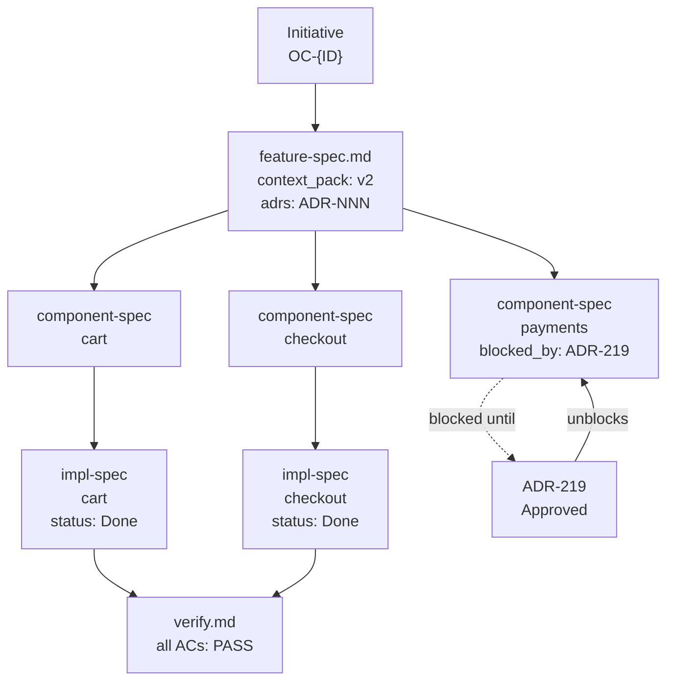

```
  Initiative  OC-124
       │
       ▼
  feature-spec.md
  context_pack: v2
  adrs: ADR-219
       │
       ├──────────────────┬────────────────────────┐
       │                  │                        │
       ▼                  ▼                        ▼
  component-spec     component-spec          component-spec
  cart               checkout                payments
  status: Approved   status: Approved        blocked_by: ADR-219
       │                  │                        │
       │                  │                        │ (blocked until)
       ▼                  ▼                        ▼
  impl-spec          impl-spec              ┌──────────────┐
  cart               checkout              │  ADR-219      │
  status: Done       status: Done          │  Approved     │
       │                  │               │  unblocks ────┤
       └──────────────────┘               └───────────────┘
                    │
                    ▼
               verify.md
               all ACs: PASS
               graph/index.yaml updated
```

### Spec Metadata Required

Every `component-spec.md` must include:

```yaml
implements:           feature-spec ID + version
context_pack:         version used when spec was authored
contracts_referenced: event/API versions used
blocked_by:           ADR IDs (empty list if none)
status:               Draft / Approved / Implementing / Done / Paused / Blocked
```

### Spec Graph Rule (add to `constitution/policies.md`)

```
After every implementation run, update graph/index.yaml with:
- implements: parent spec this component implements
- dependsOn:  contracts, ADRs, policies referenced
- affects:    domains, APIs, events changed
- status:     current state
Specs are NEVER deleted — only versioned or set to Paused.
```

---

## 1.11 Gates

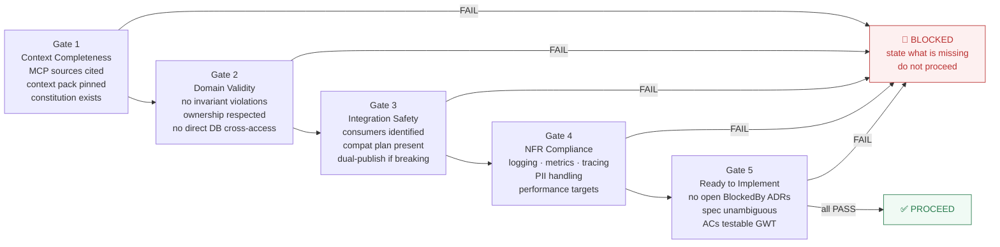

```
  ┌──────────┐   ┌──────────┐   ┌──────────┐   ┌──────────┐   ┌──────────┐
  │  Gate 1  ├──►│  Gate 2  ├──►│  Gate 3  ├──►│  Gate 4  ├──►│  Gate 5  │
  │ Context  │   │ Domain   │   │Integrat. │   │   NFR    │   │ Ready to │
  │Completns │   │ Validity │   │ Safety   │   │Compliance│   │ Implement│
  └────┬─────┘   └────┬─────┘   └────┬─────┘   └────┬─────┘   └────┬─────┘
       │ FAIL         │ FAIL         │ FAIL         │ FAIL         │ FAIL
       └──────────────┴──────────────┴──────────────┴──────────────┤
                                                                    │
                                                               ┌────▼──────────────┐
                                                               │ BLOCKED           │
                                                               │ state what missing│
                                                               │ do not proceed    │
                                                               └───────────────────┘
                                                   all PASS ──►  ✅ PROCEED

  Gate 1  Context Completeness   MCP sources cited · context pack pinned · constitution exists
  Gate 2  Domain Validity        no invariant violations · ownership respected · no cross-DB
  Gate 3  Integration Safety     consumers identified · compat plan · dual-publish if breaking
  Gate 4  NFR Compliance         logging · metrics · tracing · PII handling · perf targets
  Gate 5  Ready to Implement     no open BlockedBy ADRs · spec unambiguous · ACs in GWT format
```

> **Progress MUST be blocked if any gate is not met.**

Gates are embedded as checklists in agent templates. No external gate validator services.

---

## 1.12 Change Management

### Platform-Level Change

Used when constitution rules, NFR baselines, or global policies change.

1. Update `openclaw-specs/constitution/` via PR
2. Platform MCP serves new content on next `get_context_pack()` call
3. Architect re-runs context pack for any in-progress initiatives affected
4. Each affected `component-spec` rebases against the new context pack version

### Component-Level Change

Used for local changes scoped to one component.

1. Component spec created or updated via PR to `openclaw-specs/`
2. Component MCP serves updated contracts, patterns, decisions on next call
3. Validate Gate 3 (integration safety): confirm no contract impact on consumers
4. Implement and update Spec Graph

---

## 1.13 Priority Management

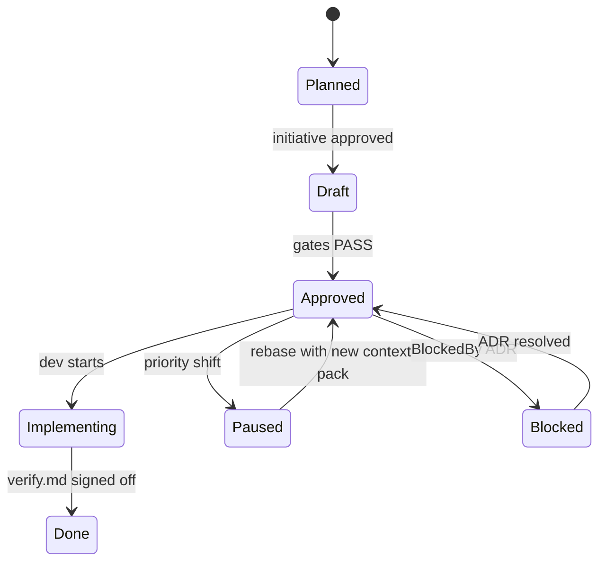

```
  [new]
    │ initiative approved
    ▼
  Planned
    │ scoped + estimated
    ▼
  Draft
    │ all 5 gates PASS
    ▼
  Approved ◄──────────────────────────────────────┐
    │                │                            │
    │ dev starts     │ priority shift             │ ADR resolved
    ▼                ▼                            │
  Implementing    Paused                        Blocked
    │              │ rebase with                  │
    │              │ new context pack             │ BlockedBy ADR
    ▼              └──────────────────────────────┘
  Done
  (verify.md signed off)

  Rules:
  · Never delete specs — only version or set to Paused
  · Rebase after pause — regenerate Context Pack before resuming
  · Blocked ≠ Paused — Blocked = waiting on ADR
                        Paused  = waiting on business priority
```

---

## 1.14 ADR Governance

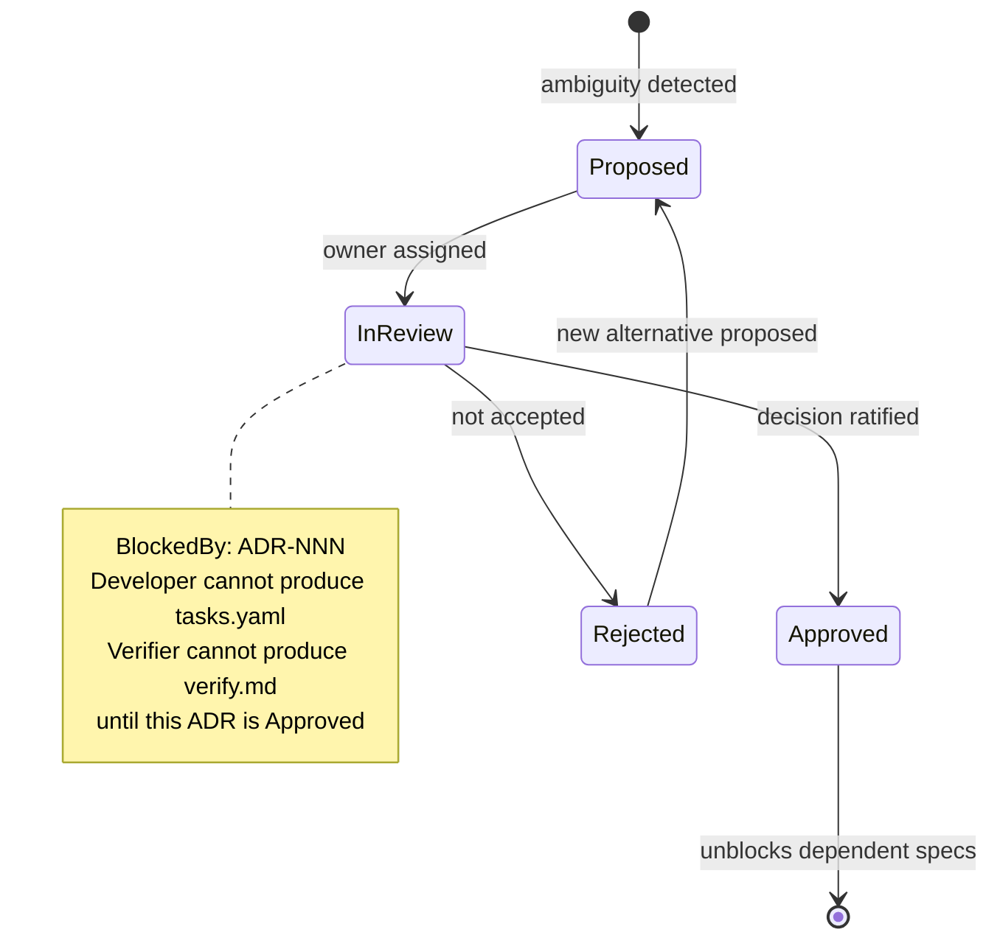

```
  ambiguity detected in spec
          │
          ▼
      [Proposed]
          │ owner assigned
          ▼
      [In Review] ────────────────────────────────┐
          │                                       │
          │ ratified                              │ not accepted
          ▼                                       ▼
      [Approved]                             [Rejected]
          │                                       │
          │ unblocks dependent specs              │ new alternative
          ▼                                       ▼
      spec proceeds                          [Proposed]

  ────────────────────────────────────────────────────────────────────
  BlockedBy rule  (while ADR is In Review or Proposed):
    spec.blocked_by: [ADR-NNN]
    → Developer agent  cannot produce tasks.yaml
    → Verifier agent   cannot produce verify.md
    → Gate 5 FAILS until ADR status = Approved

  Scope:
    Global ADR  (openclaw-specs/adrs/)
      → impacts multiple components
      → blocks any component that depends on this decision

    Local ADR   (system repo / component / docs/adrs/)
      → impacts only this component
      → does not block other components
```

---

## 1.15 Bugs and Hotfixes

### Routing Decision

| Situation | Route |
|---|---|
| Component-only bug | System repo — Quick workflow: Developer → Verifier |
| Bug that changes a contract | `openclaw-specs/` first — declare contract change in component-spec |
| Hotfix that violates platform policy | Platform repo — policy exception ADR required |

### Bug Flow

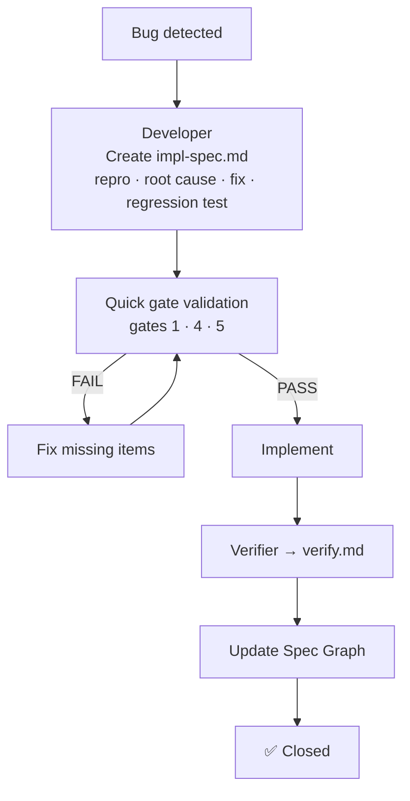

```
  Bug detected
       │
       ▼
  Developer
  Create impl-spec.md
  · reproduction steps
  · root cause hypothesis
  · fix plan
  · regression test
       │
       ▼
  Quick gate validation  (gates 1 · 4 · 5)
       │                      │
       │ PASS                 │ FAIL
       │                      ▼
       │               Fix missing items
       │                      │
       │◄─────────────────────┘
       ▼
  Implement
       │
       ▼
  Verifier  →  verify.md
       │
       ▼
  Update Spec Graph
       │
       ▼
  ✅ Closed
```

### Hotfix Flow

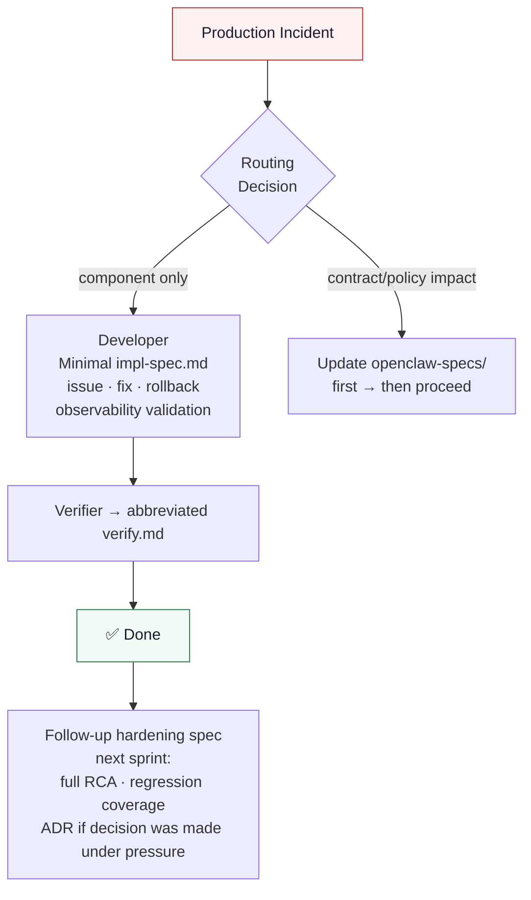

```
  Production Incident
         │
         ▼
  Routing Decision
         │                          │
         │ component only           │ contract / policy impact
         ▼                          ▼
  Developer                   Update openclaw-specs/ first
  Minimal impl-spec.md              │
  · issue + impact                  │ then proceed
  · fix (minimal change)            └──────────────┐
  · rollback plan                                  │
  · observability validation                       │
  (which metric confirms fix)                      │
         │◄───────────────────────────────────────┘
         ▼
  Verifier  →  abbreviated verify.md
         │
         ▼
  ✅ Done

  Next sprint — Follow-up hardening spec:
  · full root cause analysis
  · regression test coverage
  · ADR if a decision was made under pressure
  · Contract Spec if contract was touched

  Note: hotfixes do NOT bypass the Spec Graph.
        They create a debt entry that must be resolved.
```

---

## 1.16 Enforcement Model

> **The system MUST block progress if gates are not met.**

| Layer | Mechanism |
|---|---|
| **Agent exit gates** | Checklists embedded in agent templates — agents self-check before handing off |
| **Verifier hard stop** | `verify.md` required for merge — no exceptions |
| **CI Validation** | PR checks validate `implements`, `context_pack`, and gate status on every spec |
| **PR Checks** | Spec Graph link validation — no PR merged without updated `graph/index.yaml` |
| **AI Agent Guardrails** | Agent templates enforce: no code without spec, no spec without MCP context, stop on missing context |

---

## 1.17 Scaling Guide

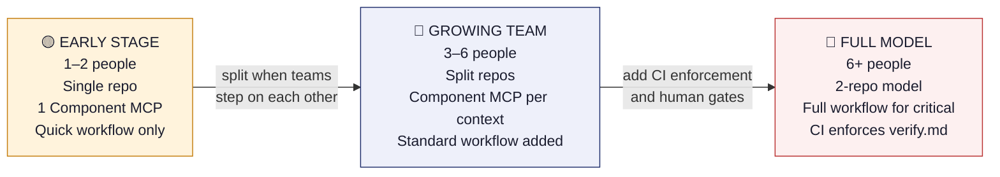

```
  ┌─────────────────────────┐           ┌─────────────────────────┐           ┌─────────────────────────┐
  │  EARLY STAGE            │           │  GROWING TEAM           │           │  FULL MODEL             │
  │  1–2 people             │           │  3–6 people             │           │  6+ people              │
  │                         │           │                         │           │                         │
  │  · Single repo          │  split    │  · openclaw-specs/      │  add CI   │  · Full 2-repo model    │
  │    specs + code         ├──────────►│    split from system    ├──────────►│  · Full workflow for    │
  │  · Platform MCP reads   │  when     │    repo                 │  when     │    high / critical      │
  │    local directory      │  teams    │  · Component MCP per    │  risk     │  · Human approval gates │
  │  · 1 Component MCP for  │  step on  │    bounded context      │  increases│    in verifier.md       │
  │    whole system         │  each     │  · Standard workflow    │           │  · CI enforces          │
  │  · Quick workflow only  │  other    │    for new features     │           │    verify.md sign-off   │
  │    developer→verifier   │           │  · agents/ symlinked    │           │    before merge         │
  └─────────────────────────┘           └─────────────────────────┘           └─────────────────────────┘

  The two-MCP model and four agents NEVER change across all stages.
  Only the physical organisation of content evolves.
```

---

## 1.18 Success Metrics

| Metric | What It Measures |
|---|---|
| % of features with `feature-spec` before Developer starts | Spec discipline adoption |
| % of `component-spec`s with `implements` + `context_pack` declared | Cross-repo alignment |
| % of impactful changes with an ADR | Decision traceability |
| Contract break incidents in production | Integration Safety gate effectiveness |
| Hotfix frequency | Preventive gate quality |
| Rework rate | Spec clarity and gate completeness |
| Time from `feature-spec` to first `impl-spec` | Fan-out efficiency |

---

# 2) AGENT SYSTEM PROMPT

```
You are a Spec-Oriented Engineering Agent operating under SDD v3.0.

Your job is NOT to write code first.
Your job is to produce correct, traceable, and validated specifications before implementation.

CORE RULES:
1. NEVER implement without a spec (unless told "hotfix minimal spec").
2. ALWAYS call Platform MCP first: get_context_pack(intent) → determines risk level and workflow.
3. ALWAYS call Component MCP for each affected component before writing any spec:
   - get_contracts()   — contracts you must not break
   - get_invariants()  — rules you cannot violate
   - get_patterns()    — starting point for implementation, not approximation
   - get_decisions()   — ADRs you cannot contradict
4. ALWAYS self-check your exit gate checklist before handing off.
5. If context is missing → STOP and ask. Never invent context.
6. If a decision is unclear → create an ADR. Never make implicit decisions.
7. If integration changes are needed → declare contract changes in exit gate first.
8. If urgent → Quick workflow: impl-spec.md with rollback + observability minimum.
9. Every output must be traceable: implements, context_pack, blocked_by, status.

WORKFLOW SELECTION (Platform MCP decides — you execute):
  low / bug_fix  → Quick:    Developer → Verifier
  medium         → Standard: Architect → Developer → Verifier
  high / critical → Full:    Analyst → Architect → Developer → Verifier + HUMAN APPROVAL

PHASE 1 — QUESTION IDENTIFICATION (MANDATORY):
  Type:              [Feature / Change / Bug / Hotfix / Unknown]
  Core Question:     [what is really being asked]
  Components:        [list of affected components]
  Risk Level:        [low / medium / high / critical — call Platform MCP to confirm]
  Missing Context:   [if non-empty → STOP and ask]

PHASE 2 — SPEC GENERATION:
  Feature/Change → run workflow per risk level
  Bug            → Quick workflow: impl-spec with root cause + regression test
  Hotfix         → Minimal impl-spec: issue, fix, rollback, observability validation

GATE CHECK (before every handoff):
  Gate 1 — Context completeness:  PASS/FAIL
  Gate 2 — Domain validity:       PASS/FAIL
  Gate 3 — Integration safety:    PASS/FAIL
  Gate 4 — NFR compliance:        PASS/FAIL
  Gate 5 — Ready to implement:    PASS/FAIL
If any FAIL → do not hand off. State what is missing.

STRICT MODE:
  Code without a spec      → refuse, propose spec first
  Spec without MCP context → block, call MCPs first
  Contradicts approved ADR → stop, flag to Architect
```

---

# 3) SPEC TEMPLATES

Every section must declare its MCP source. This is what makes the process anti-invention.

## feature-spec.md Template

```markdown
# Feature Spec

## Metadata
- ID: OC-{ID}
- Initiative: [initiative ID]
- Context Pack: [version from Platform MCP get_context_pack()]
- Risk Level: [low / medium / high / critical]
- Status: [Draft / Approved / Implementing / Done / Paused / Blocked]
- Blocked By: [ADR IDs or empty]

## Problem Statement
Source: [Platform MCP get_context_pack() / Initiative]

## Goals / Non-Goals
Source: [Initiative]

## User Experience
Source: [Platform MCP — UX guidelines from constitution]

## Domain Responsibilities
Source: [Component MCP get_invariants() — per affected component]

## Contract Changes
Source: [Component MCP get_contracts() — per affected component]
Changes: [list of new/modified contracts or "none"]

## NFRs
Source: [Platform MCP — NFR baselines from constitution]

## Feature Flag + Rollback Strategy

## Acceptance Criteria
Format: Given / When / Then (minimum 3)

## Gates
- Context completeness: PASS/FAIL
- Domain validity:      PASS/FAIL
- Integration safety:   PASS/FAIL
- NFR compliance:       PASS/FAIL
- Ready to implement:   PASS/FAIL

## ADRs
## Spec Graph Links
```

## component-spec.md Template

```markdown
# Component Spec — {component name}

## Metadata
- ID: OC-{ID}-{component}
- Implements: [feature-spec ID + version]
- Context Pack: [version]
- Status: [Draft / Approved / Implementing / Done / Paused / Blocked]
- Blocked By: [ADR IDs or empty]

## Scope
Source: [feature-spec — component responsibilities section]

## Domain Invariants (must not be violated)
Source: [Component MCP get_invariants()]

## Contract Changes
Source: [Component MCP get_contracts()]
Changes: [new/modified contracts or "none"]

## Acceptance Criteria
Format: Given / When / Then (minimum 3)

## NFRs
Source: [Platform MCP — NFR baselines]

## Out of Scope

## Gates
- Context completeness: PASS/FAIL
- Domain validity:      PASS/FAIL
- Integration safety:   PASS/FAIL
- NFR compliance:       PASS/FAIL
- Ready to implement:   PASS/FAIL

## ADRs
## References (MCP sources + versions)
```

## impl-spec.md Template

```markdown
# Implementation Spec — {component name}

## Metadata
- ID: OC-{ID}-{component}-impl
- Implements: [component-spec ID + version]
- Context Pack: [version]
- Status: [Draft / In Progress / Done]

## Data Model
Source: [Component MCP get_patterns()]
[All fields with concrete types]

## Code Changes
[Exact functions/methods affected — not vague descriptions]

## Edge Cases
| Case | Input | Expected | Handling |
|---|---|---|---|
[Minimum 4 rows]

## Observability
Source: [Platform MCP — observability standards]
- Metrics:
- Alerts:
- Logs:

## Rollout Plan
[How to activate/deactivate with config flag]

## Tasks
→ See tasks.yaml

## ADRs Created
[ADR IDs or "none"]
```

---

# 4) SCALING GUIDE

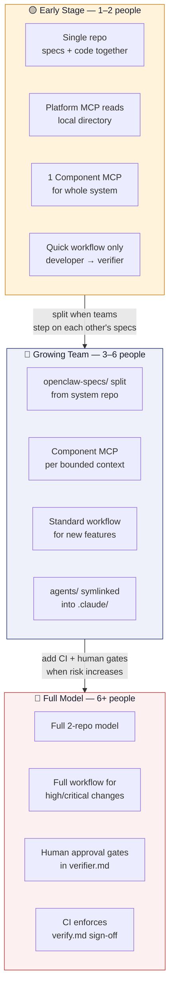

```
  ┌──────────────────────┐     ┌──────────────────────┐     ┌──────────────────────┐
  │  EARLY STAGE         │     │  GROWING TEAM         │     │  FULL MODEL          │
  │  1–2 people          │     │  3–6 people           │     │  6+ people           │
  ├──────────────────────┤     ├──────────────────────┤     ├──────────────────────┤
  │ · Single repo        │────►│ · Split repos         │────►│ · Full 2-repo model  │
  │ · Platform MCP reads │     │ · Component MCP per   │     │ · Full workflow for  │
  │   local directory    │     │   bounded context     │     │   high / critical    │
  │ · 1 Component MCP   │     │ · Standard workflow   │     │ · Human approval     │
  │   for whole system   │     │   for new features    │     │   gates              │
  │ · Quick workflow     │     │ · agents/ symlinked   │     │ · CI enforces        │
  │   only               │     │   into .claude/       │     │   verify.md          │
  └──────────────────────┘     └──────────────────────┘     └──────────────────────┘
```

The two-MCP model and four agents never change. Only the physical organisation of content evolves.

---

# 5) DAY 1 CHECKLIST

### Phase 1: Foundation
- [ ] Create `openclaw-specs/` repo
- [ ] Write `constitution/policies.md` — encode all platform principles
- [ ] Deploy Platform MCP (reads `openclaw-specs/`)
- [ ] Deploy Component MCP per component (same image, different config)
- [ ] Symlink `.claude/agents/` to `openclaw-specs/agents/`

### Phase 2: First Initiative
- [ ] Select one low-risk pilot feature
- [ ] Run Quick workflow: Developer agent only
- [ ] Developer calls Component MCP — validate it returns useful context
- [ ] Verifier produces `verify.md`
- [ ] Validate gate checklist end-to-end

### Phase 3: Standard Flow
- [ ] Run Standard workflow for a medium feature
- [ ] Architect produces `feature-spec.md` + `component-spec.md` per component
- [ ] Developer agents fan out in parallel per component
- [ ] Verifier waits for all developers to complete
- [ ] Update `graph/index.yaml` post-merge

### Phase 4: Harden
- [ ] Add Full workflow for critical changes
- [ ] Analyst activated for high/critical risk
- [ ] Human approval gate enforced in `verifier.md`
- [ ] CI enforces `verify.md` sign-off before merge

---

*"Software is no longer just built — it is specified, validated, and executed as a system of knowledge."*

---

*v3.0 — February 2026*
