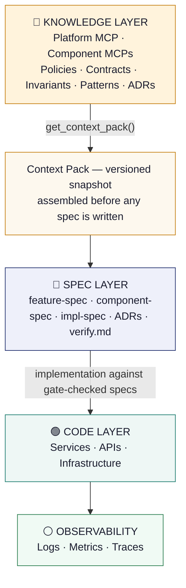
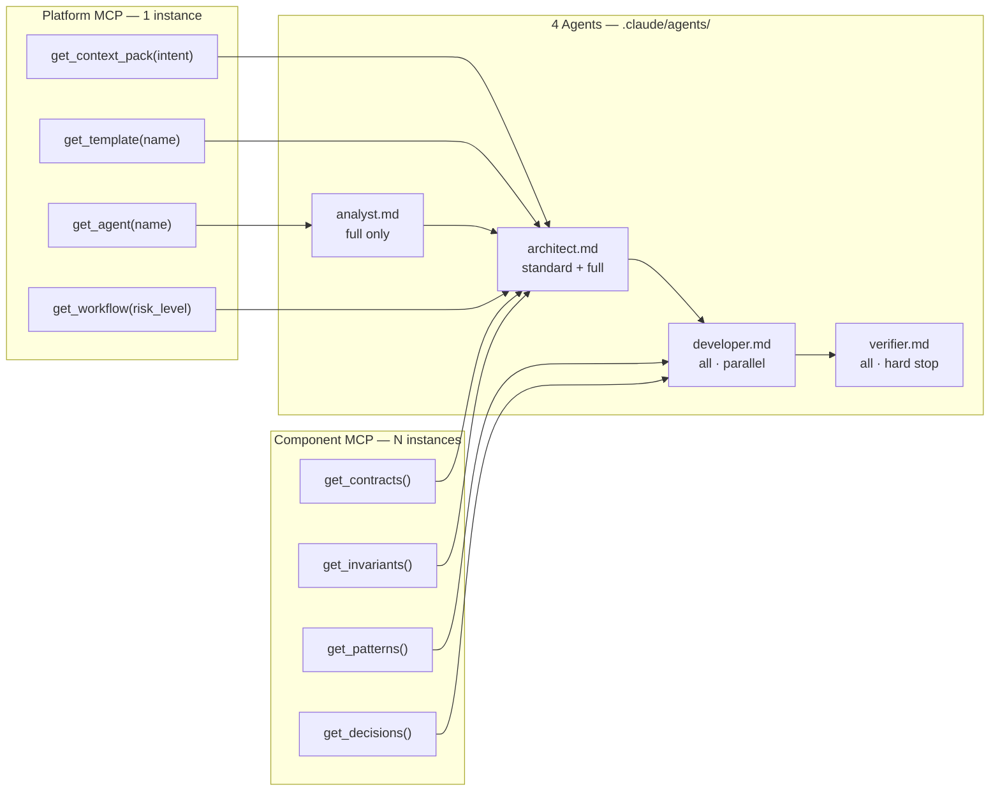
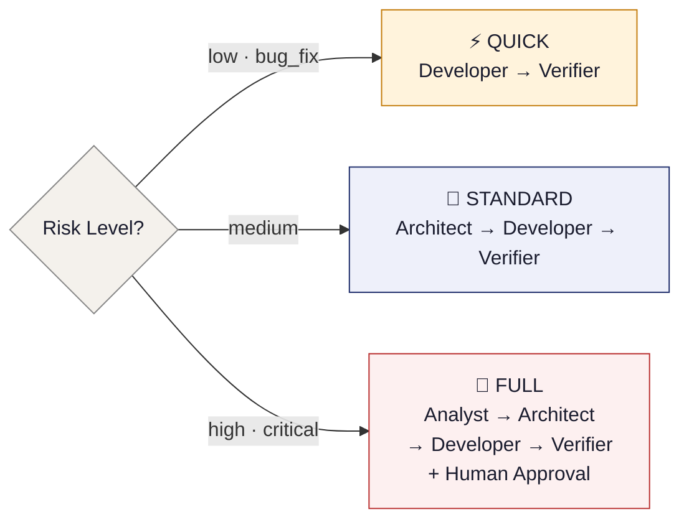

# One Pager
## Spec-Driven Development (SDD) v3.0
**Two MCPs · Four Agents · Zero Overhead Services**

> *Version 3.0 — February 2026*
> *"Nothing is implemented without a validated spec backed by governed context."*

---

## 🎯 Problem

Modern distributed platforms have a **knowledge problem**, not just a code problem:

- Teams interpret the same requirement differently → misalignment and rework
- Service contracts break silently → costly integration bugs
- Decisions live in Slack and people's heads → no audit trail, tribal knowledge
- AI agents invent context from the codebase → unpredictable, unsafe outputs
- Onboarding requires human explanation → doesn't scale

---

## 💡 Solution

Adopt **SDD v3.0** with two MCP server types, four Markdown agents, and zero overhead infrastructure:

| Component | What it does |
|---|---|
| **Platform MCP** (1 instance) | Serves context packs, templates, agent definitions, workflow configs |
| **Component MCP** (N instances) | Same image, different config per component — serves contracts, invariants, patterns, ADRs |
| **4 Agents** (Markdown files) | `analyst` · `architect` · `developer` · `verifier` — loaded from `.claude/agents/`, gates embedded as checklists |
| **Spec Graph** | Traceable chain: Initiative → feature-spec → component-specs → verify.md → ADRs |

---

## 🧠 Core Principle

> *"Nothing is implemented without a validated spec backed by governed context."*

Agents — human or AI — do not invent context. They **call MCP tools** to get governed truth.

---

## 🧬 Methodology Origins

SDD v3.0 is a deliberate composition of proven ideas. Three frameworks provided the structural core — every practice listed here was adopted because it directly changes what an agent or engineer produces. Everything else was cut.

**BMAD — Breakthrough Method for Agile AI Development**
The four-agent architecture (analyst → architect → developer → verifier) comes directly from BMAD. Each agent has a single bounded responsibility, produces one or two files, and enforces a self-checked exit gate before handing off. The parallel fan-out pattern — one Developer agent per component running simultaneously after the Architect completes the feature-spec — is also a BMAD practice. *Why we adopted it: role-scoped agents prevent context overreach. Parallel fan-out eliminates the bottleneck that makes large cross-domain features slow.*

**OpenSpec — Open Specification Format**
The traceability metadata on every spec (`implements`, `context_pack`, `blocked_by`, `status`) comes from OpenSpec. So does the Spec Graph (`graph/index.yaml`) — the machine-readable index that links every artifact from Initiative through verify.md, updated by the Verifier after every merge. The rule that specs are never deleted, only versioned or paused, is also OpenSpec. *Why we adopted it: without mandatory metadata, a spec is an island. The Spec Graph is the audit trail — it answers "what was built, why, against what context, and was it verified?"*

**SpecKit — Template-Driven Spec Assembly**
The template-with-embedded-exit-gate pattern comes from SpecKit. Rather than writing a spec and separately checking it, the checklist lives inside the template — the agent writes and self-verifies in one pass. The Context Pack mechanism — a pinned, versioned snapshot of applicable policies, NFR baselines, and workflow config assembled before any spec is written — is also a SpecKit practice. Templates are served by Platform MCP (`get_template(name)`) so they evolve without agent file changes. *Why we adopted it: embedding the gate in the template closes the gap between writing and verifying. Pinning the context pack makes specs reproducible — another agent can retrieve the same context and understand what constraints were in effect.*

---

## 🏗️ System Layers



```
┌─────────────────────────────────────────────────────┐
│              KNOWLEDGE LAYER  (MCP Servers)         │
│   Platform MCP · Component MCPs (×N)               │
│   Policies · Contracts · Invariants · Patterns      │
└─────────────────────┬───────────────────────────────┘
                      │  get_context_pack()
                      │  Context Pack (versioned snapshot)
                      ▼
┌─────────────────────────────────────────────────────┐
│                   SPEC LAYER  (2 repos)             │
│   feature-spec · component-spec · impl-spec         │
│   ADRs · verify.md                                  │
└─────────────────────┬───────────────────────────────┘
                      │  implementation against
                      │  gate-checked specs
                      ▼
┌─────────────────────────────────────────────────────┐
│                   CODE LAYER                        │
│          Services · APIs · Infrastructure           │
└─────────────────────┬───────────────────────────────┘
                      ▼
┌─────────────────────────────────────────────────────┐
│                  OBSERVABILITY                      │
│              Logs · Metrics · Traces                │
└─────────────────────────────────────────────────────┘
```

---

## 🧩 Two MCPs, Four Agents



```
┌─────────────────────────────┐   ┌──────────────────────────────┐
│   Platform MCP  (1 instance)│   │  Component MCP  (N instances)│
│                             │   │                              │
│  get_context_pack(intent)───┼─┐ │  get_contracts() ───────────┼─┐
│  get_template(name) ────────┼─┤ │  get_invariants()───────────┼─┤
│  get_agent(name)────────────┼─┤ │  get_patterns() ────────────┼─┼──┐
│  get_workflow(risk_level)───┼─┘ │  get_decisions()────────────┼─┼──┤
└─────────────────────────────┘   └──────────────────────────────┘  │
          │                                  │                       │
          ▼                                  ▼                       │
┌─────────────────────────────────────────────────────────────────┐ │
│                  4 Agents  (.claude/agents/)                    │ │
│                                                                 │ │
│  analyst.md ──► architect.md ──► developer.md ──► verifier.md  │ │
│  (full only)    (std + full)     (all · parallel) (all · stop) │◄┘
└─────────────────────────────────────────────────────────────────┘
```

---

## 🔄 Three Workflows



```
            ┌─────────────────────┐
            │   Risk Level?       │
            │  (Platform MCP      │
            │   decides)          │
            └──┬──────┬───────────┘
               │      │           │
         low / │      │ medium    │ high / critical
        bug_fix│      │           │
               ▼      ▼           ▼
  ┌────────────────┐ ┌──────────────────────┐ ┌────────────────────────────┐
  │  QUICK         │ │  STANDARD            │ │  FULL                      │
  │                │ │                      │ │                            │
  │  Developer     │ │  Architect           │ │  Analyst                   │
  │     │          │ │     │                │ │     │                      │
  │  Verifier      │ │  Developer (║ parallel) │  Architect               │
  │                │ │     │                │ │     │                      │
  │                │ │  Verifier            │ │  Developer (║ parallel)   │
  └────────────────┘ └──────────────────────┘ │     │                      │
                                              │  Verifier + Human Gate     │
                                              └────────────────────────────┘
```

Developers fan out **in parallel per component** once `feature-spec.md` is ready.

---

## 👥 Roles

| Role | Responsibility |
|---|---|
| **Product Manager** | Initiative, business goals, UX intent |
| **Platform Architect** | Constitution, templates, workflows, Spec Graph — content Platform MCP serves |
| **Domain Owner** | Component invariants, contracts, patterns, ADRs — content Component MCP serves |
| **Component Team** | Runs Developer + Verifier agents · produces impl-spec + code |
| **AI Agents** | analyst · architect · developer · verifier — call MCPs, self-check gates, produce traceable outputs |

---

## ⚖️ Comparison

| Without SDD | With SDD v3.0 |
|---|---|
| Implicit, undocumented specs | Explicit versioned specs with ACs |
| Integration bugs in QA or prod | Gates block bugs before implementation |
| Decisions in Slack | Every decision is an ADR with audit trail |
| AI agents invent context | Agents consume governed MCP context |
| Onboarding requires tribal knowledge | Context Packs enable fast, safe onboarding |

---

## 🚀 Benefits

- Cross-domain consistency — all agents work from the same governed truth
- Fewer integration bugs — contracts versioned, gate-checked before any code is written
- Full traceability — Initiative → feature-spec → component-specs → verify.md → ADRs
- Scales from 1 person to 50+ — same two MCP types and four agents throughout
- AI-agent ready — structured context eliminates hallucinated decisions
- Compound knowledge — each initiative enriches the MCP for the next one
- Zero infrastructure overhead — all process lives in Markdown, not servers

---

## 🔑 Final Insight

> *"Software is no longer just built — it is specified, validated, and executed as a system of knowledge."*

---

*Target Operating Model · SDD + MCP · v3.0 — February 2026*
