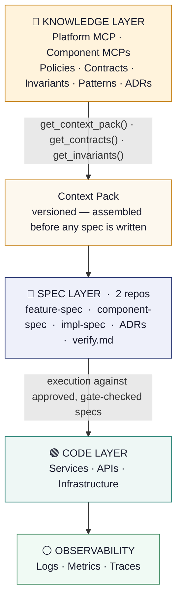
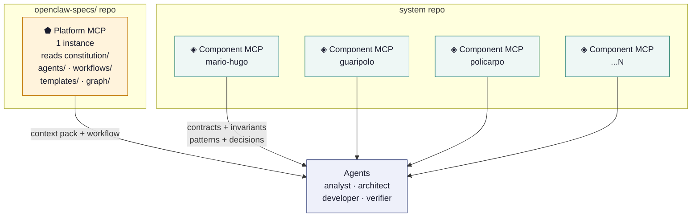
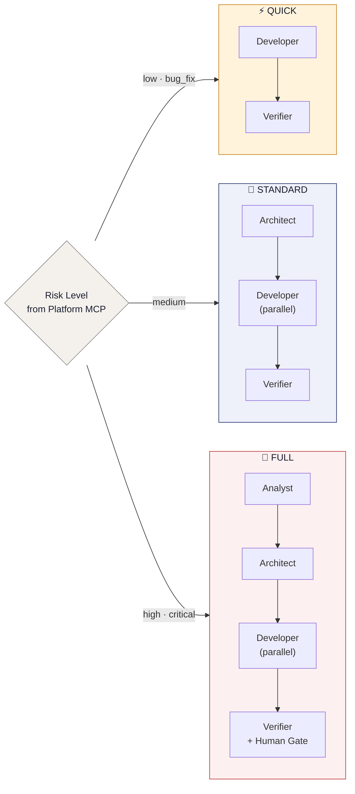
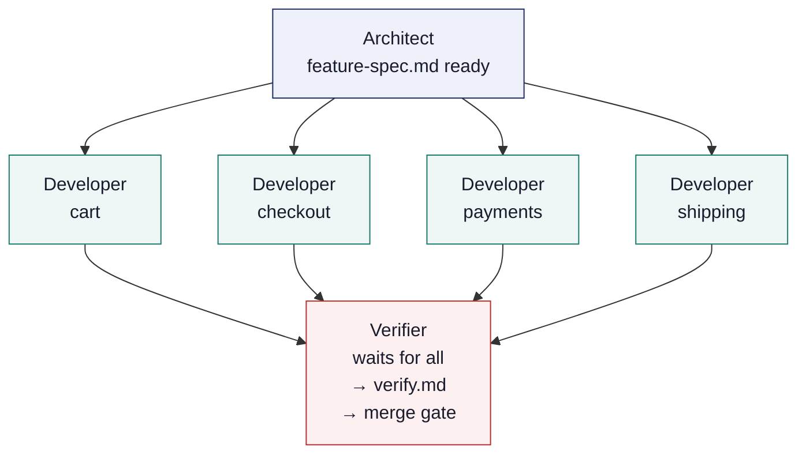
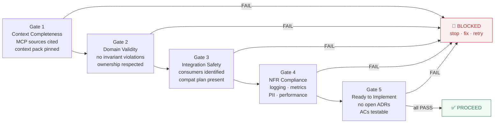
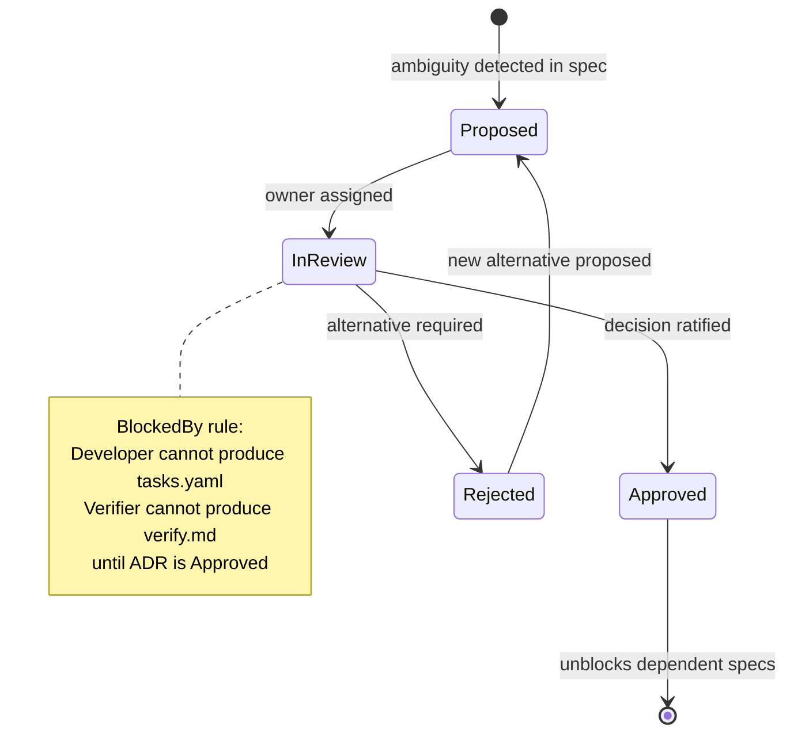
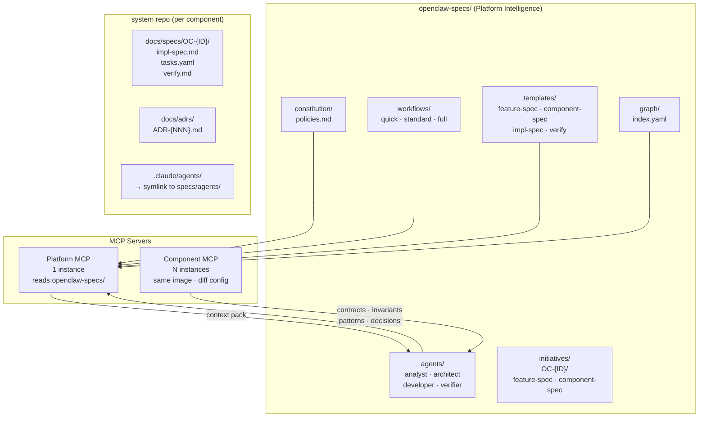
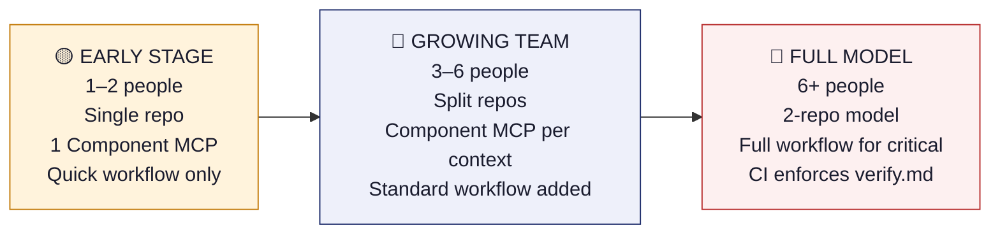

# Six Pager
## Spec-Driven Development (SDD) v3.0
**Two MCPs · Four Agents · Zero Overhead Services**

> *Version 3.0 — February 2026*
> *"Nothing is implemented without a validated spec backed by governed context."*

---

## 1. Context

Modern platforms are composed of multiple components, each with its own data model, business logic, and team:

- Catalog · Search · Cart · Checkout · Payments · Shipping · Fulfillment · Risk

The challenge:

> The user experience is unified, but the implementation is distributed.

AI coding agents make this harder. Without governed context, every agent call introduces drift between what was intended and what was built.

---

## 2. The Structural Problem

Without a governed specification system, four failure modes compound:

| Failure Mode | Root Cause | Consequence |
|---|---|---|
| **Misalignment across teams** | No shared, versioned spec | Different interpretations → inconsistent UX |
| **Fragile integrations** | Contracts not governed or versioned | API/event changes break dependent services |
| **No traceability** | Decisions in Slack, not documented | Audit fails; bugs cannot be root-caused |
| **Tribal knowledge** | Context lives in people's heads | Bottlenecks, onboarding failures, AI hallucination |

The answer is not more process. It is **governed, consumable knowledge**. Two MCP servers and four Markdown files are enough.

---

## 3. Methodology Origins — What We Took and Why

SDD v3.0 is not a new methodology. It is a deliberate composition of proven frameworks, filtered by a single criterion: *"Does this practice change what the agent or engineer writes? If not, it is cut."*

Three frameworks contributed the core structural ideas, alongside SDD, MCP, ADR governance, Agile/XP, and Lean. Each is documented below with the specific practices adopted and the rationale.

---

### BMAD — Breakthrough Method for Agile AI Development

BMAD defines the AI-native multi-agent workflow pattern. The following practices were adopted directly:

**Four bounded agent roles** — analyst, architect, developer, verifier. Each role has a single, non-overlapping responsibility. The analyst only produces `discovery.md`. The architect only produces `feature-spec.md` and `component-spec.md`. The developer only produces `impl-spec.md` and `tasks.yaml`. The verifier only produces `verify.md`. No agent does another's job.

*Why:* Role-scoped agents prevent context overreach. When an agent writes outside its bounded role, it invents context it doesn't have the right sources for. Strict role separation means each agent calls only the MCP tools it actually needs.

**Sequential handoff with hard stops** — each agent completes its exit gate checklist before the next agent starts. The Verifier is a hard stop: merge is blocked until every AC has observable evidence.

*Why:* Hard stops at each handoff make quality enforceable without an external validator service. The agent itself is the gate — it self-checks before passing work on.

**Parallel fan-out from Architect** — once `feature-spec.md` is approved, one Developer agent runs per affected component simultaneously. The Verifier waits for all to complete.

*Why:* Sequential Developer execution is the primary bottleneck in cross-domain features. Components that don't depend on each other can be built concurrently. Fan-out maintains full traceability — every Developer instance writes against the same approved feature-spec.

**Agent definitions as Markdown files** — each agent is a `.md` file in `.claude/agents/`, loaded on demand. Behaviour is expressed in text, not code.

*Why:* The team can evolve agent behaviour via PR without a deployment. Same update path as specs and templates.

*What we dropped from BMAD:* The orchestrator agent (a meta-agent that routes to specialists) — replaced by Platform MCP's `get_workflow(risk_level)`. Persona-based naming (e.g. "Alex the Architect") — role names are sufficient.

---

### OpenSpec — Open Specification Format

OpenSpec defines the structured spec format for distributed systems. The following practices were adopted:

**Mandatory traceability metadata on every spec** — `implements` (parent spec ID + version), `context_pack` (the versioned snapshot used when the spec was authored), `blocked_by` (open ADR IDs), and `status`.

*Why:* Without these fields, a spec is an island. You cannot tell what it is implementing, what context it was written against, or whether it is safe to act on. Mandatory metadata makes every spec addressable in the Spec Graph.

**Spec Graph — `graph/index.yaml`** — a machine-readable index linking every artifact in a chain: Initiative → feature-spec → component-specs → impl-specs → verify.md → ADRs. Updated by the Verifier after every merge.

*Why:* The Spec Graph is the audit trail. It answers "what was built, why, against what context, and was it verified?" — questions that matter in post-incident analysis, compliance reviews, and safe onboarding.

**MCP source citation per spec section** — every section of a spec declares where its content came from: which MCP tool, which version.

*Why:* A spec section without a source is an assertion without evidence. Citing the source makes the spec verifiable and makes it easy to detect when a spec is stale relative to a newer MCP context.

**Specs are never deleted — only versioned** — status transitions: Draft → Approved → Implementing → Done, or → Paused (waiting on business priority), or → Blocked (waiting on ADR). Specs set to Paused preserve their context pack version for safe rebasing on resumption.

*Why:* Deleted specs create invisible debt. A Paused spec with its context pack pinned can be rebased and resumed. A deleted spec is lost work that gets redone from scratch, without the benefit of prior decisions.

*What we dropped from OpenSpec:* The spec versioning server (a dedicated service managing spec diffs and conflict detection) — git handles versioning and the Spec Graph handles links, without a separate server.

---

### SpecKit — Template-Driven Spec Assembly

SpecKit defines the template-driven pattern for AI-assisted spec authoring. The following practices were adopted:

**Templates with embedded exit gate checklists** — spec templates are not blank forms. Each section includes the checklist the agent must self-verify before handing off. The template and the gate are the same artifact.

*Why:* Separating "how to write the spec" from "how to verify the spec" creates a gap where quality degrades between authoring and checking. Embedding the gate in the template closes that gap — the agent writes and checks in one pass.

**Context Pack — versioned snapshot assembled before spec writing** — before any spec is written, the agent calls Platform MCP to assemble a pinned snapshot of all applicable policies, NFR baselines, and workflow config for this intent.

*Why:* Writing a spec against a moving context is the root cause of spec drift. Pinning the context pack version makes the spec reproducible — another agent reading the same spec can retrieve the same context and understand exactly what constraints were in effect when it was written.

**Template-driven spec types** — `feature-spec`, `component-spec`, `impl-spec`, and `verify.md` each have a dedicated template. Every instance of a spec type has the same structure.

*Why:* Uniform structure means agents, humans, and CI can parse and validate specs without special-casing. The Verifier knows exactly where to find the ACs because every `component-spec` has them in the same section.

**Templates served by Platform MCP (`get_template(name)`)** — templates are not stored locally with the agent. The agent calls Platform MCP to fetch the current template at runtime.

*Why:* Template evolution is zero-friction. Update the template in the specs repo and every agent immediately gets the new version on the next call — no agent file changes required.

*What we dropped from SpecKit:* The spec scaffolding CLI (a tool that generates file stubs and validates structure at creation) — Platform MCP's `get_template()` replaces this inline, with no CLI needed.

---

## 4. Core Principle

> *"Nothing is implemented without a validated spec backed by governed context."*

Three implications:

1. **Specs are first-class artifacts** — not PR descriptions, not Confluence pages, not Slack threads
2. **Context is consumed, not invented** — agents call MCP tools to get the truth, never infer from the codebase
3. **Gates are self-enforced** — embedded checklists in agent templates, not external validator services

---

## 5. System Layers



```
┌──────────────────────────────────────────────────────────────┐
│                   KNOWLEDGE LAYER  (MCP Servers)             │
│                                                              │
│  ┌─────────────────────────┐  ┌───────────────────────────┐ │
│  │  Platform MCP           │  │  Component MCP  (×N)      │ │
│  │  1 instance             │  │  same image · diff config │ │
│  │  reads openclaw-specs/  │  │  per component            │ │
│  └─────────────────────────┘  └───────────────────────────┘ │
└──────────────────────────┬───────────────────────────────────┘
                           │  get_context_pack()
                           │  get_contracts() · get_invariants()
                           │  Context Pack  (versioned)
                           ▼
┌──────────────────────────────────────────────────────────────┐
│                    SPEC LAYER  (2 repos)                     │
│                                                              │
│   feature-spec.md  ·  component-spec.md  ·  impl-spec.md    │
│   ADRs  ·  verify.md  ·  tasks.yaml                         │
└──────────────────────────┬───────────────────────────────────┘
                           │  execution against
                           │  approved, gate-checked specs
                           ▼
┌──────────────────────────────────────────────────────────────┐
│                      CODE LAYER                              │
│              Services  ·  APIs  ·  Infrastructure            │
└──────────────────────────┬───────────────────────────────────┘
                           ▼
┌──────────────────────────────────────────────────────────────┐
│                     OBSERVABILITY                            │
│                 Logs  ·  Metrics  ·  Traces                  │
└──────────────────────────────────────────────────────────────┘
```

---

## 6. Solution Components

### 5.1 Platform MCP — 1 instance per organisation

Reads `openclaw-specs/`. Never requires redeployment — update the specs repo and the MCP serves new knowledge immediately.

| Tool | Returns |
|---|---|
| `get_context_pack(intent)` | Risk level + applicable policies + workflow config |
| `get_template(name)` | Template with embedded exit gate checklist |
| `get_agent(name)` | Full agent definition (analyst/architect/developer/verifier) |
| `get_workflow(risk_level)` | Which agents to activate for this change |

### 5.2 Component MCP — N instances (same image, different config)

One instance per component. Same Docker image, different environment config per component.

| Tool | Returns |
|---|---|
| `get_contracts()` | NATS topics, HTTP endpoints, event schemas, consumer list |
| `get_invariants()` | Immutable business rules — cannot be violated |
| `get_patterns()` | Approved implementation patterns + canonical examples |
| `get_decisions()` | ADRs + prior technical decisions |



```
  openclaw-specs/                   system repo
  ┌────────────────────┐            ┌──────────────────┐
  │  Platform MCP      │            │ Component MCP    │
  │  1 instance        │            │ mario-hugo       │
  │                    │            ├──────────────────┤
  │  constitution/     │            │ Component MCP    │
  │  agents/           │            │ guaripolo        │
  │  workflows/        │            ├──────────────────┤
  │  templates/        │            │ Component MCP    │
  │  graph/            │            │ policarpo        │
  └────────┬───────────┘            ├──────────────────┤
           │ context pack           │ Component MCP    │
           │ + workflow             │ ... N            │
           └──────────┐            └────────┬─────────┘
                      │                     │ contracts
                      │                     │ invariants
                      │                     │ patterns
                      │                     │ decisions
                      ▼                     ▼
              ┌─────────────────────────────────┐
              │   Agents  (.claude/agents/)     │
              │                                 │
              │  analyst · architect            │
              │  developer · verifier           │
              └─────────────────────────────────┘
```

### 5.3 Four Agents — Markdown files in `.claude/agents/`

All process in four files. Gates are embedded checklists — agents self-check before handing off.

---

**`analyst.md`** — Full workflow only (high/critical). Produces `discovery.md`.

Exit gate: problem statement with metric · evidence with real data · ≥2 user stories · affected components · risk level classified

---

**`architect.md`** — Standard + Full. Calls Platform MCP + Component MCP per affected component. Cannot contradict an approved ADR.

Produces: `feature-spec.md` + `component-spec.md` per affected component.

Exit gate: ≥3 ACs Given/When/Then · NFRs with concrete numbers · contract changes declared · feature flag + rollback · `REQUIRES HUMAN APPROVAL` if critical

---

**`developer.md`** — All workflows. Parallel per component. Patterns from MCP are the starting point, never approximated.

Produces: `impl-spec.md` + `tasks.yaml` per component.

Exit gate: all data fields with types · exact code changes · edge cases table ≥4 · observability section · rollout plan · tasks.yaml complete

---

**`verifier.md`** — All workflows. Waits for all developers. Hard stop before merge.

Produces: `verify.md` with all ACs PASS/FAIL + observable evidence.

Exit gate: every AC verified with evidence · no unresolved `REQUIRES HUMAN APPROVAL` · tests + lint pass · `graph/index.yaml` updated

---

## 7. Development Flow

### Three Workflows



```
  Risk Level?  (Platform MCP decides)
       │
       ├─── low / bug_fix ──────────────────────────────────────────┐
       │                                                            │
       │    QUICK                                                   │
       │    Developer ──► Verifier                                  │
       │                                                            │
       ├─── medium ─────────────────────────────────────────────────┤
       │                                                            │
       │    STANDARD                                                │
       │    Architect ──► Developer (║ parallel) ──► Verifier      │
       │                                                            │
       └─── high / critical ────────────────────────────────────────┤
                                                                    │
            FULL                                                    │
            Analyst ──► Architect ──► Developer (║) ──► Verifier  │
                                                    + Human Gate    │
                                                                    ▼
                                                              merge gate
```

### Fan-Out — Architect to Developer



```
         Architect
         feature-spec.md ready
              │
     ┌────────┼────────┬────────┐
     │        │        │        │
     ▼        ▼        ▼        ▼
  Developer  Dev    Developer  Developer
   cart    checkout payments  shipping
     │        │        │        │
     └────────┴────────┴────────┘
                     │
                     ▼
               Verifier
               waits for ALL
               ──────────────
               verify.md
               merge gate  ◄── hard stop
```

---

## 8. Real Example: Guest Checkout

**Without SDD**

- Checkout implements the flow independently, inventing the state machine
- Cart uses different state logic → cart and checkout desynchronise
- Payments modifies events without notifying consumers → silent contract break
- Shipping breaks because a required field is missing from the order event
- QA detects all of this weeks after implementation

Result: integration bugs, emergency rework, delayed release.

**With SDD v3.0**

- Platform MCP determines risk level: medium → Standard workflow
- Architect calls Component MCP for Cart, Checkout, Payments, Shipping contracts and invariants
- `feature-spec.md` defines end-to-end UX, domain responsibilities, and all contract changes
- `component-spec.md` per domain specifies ACs in Given/When/Then with NFR numbers
- Contract changes declared explicitly — consumer list updated, versioning rules applied
- Developer agents run in parallel; Verifier blocks merge until every AC has observable evidence

Result: zero surprise integration bugs, full audit trail, predictable delivery.

---

## 9. Gates



```
  G1 ──► G2 ──► G3 ──► G4 ──► G5
  │      │      │      │      │
  │ FAIL │ FAIL │ FAIL │ FAIL │ FAIL
  └──┐   └──┐   └──┐   └──┐   └──┐
     ▼      ▼      ▼      ▼      ▼
  ┌─────────────────────────────────┐
  │  BLOCKED                        │
  │  state what is missing          │
  │  do not proceed                 │
  └─────────────────────────────────┘

  G1  Context Completeness   MCP sources cited · context pack pinned
  G2  Domain Validity        no invariant violations · ownership respected
  G3  Integration Safety     consumers identified · compat plan present
  G4  NFR Compliance         logging · metrics · PII · performance targets
  G5  Ready to Implement     no open ADRs · ACs testable in GWT format

  All 5 PASS → ✅ PROCEED
```

Gates are embedded as checklists in agent templates. Agents self-check — no external validator services.

---

## 10. Change Management

### Platform-Level Change
- Update `openclaw-specs/constitution/` via PR
- Platform MCP serves new content on next `get_context_pack()` call
- Architect re-runs context pack for any in-progress initiatives affected

### Component-Level Change
- Component spec updated via PR to `openclaw-specs/`
- Component MCP serves updated content on next call
- Faster — governed but local, no cross-domain re-alignment required

### Versioning Rule
> Specs are never deleted — only versioned. Mark as **Paused**, preserve the version, rebase with updated context when resumed.

---

## 11. ADRs



```
  ambiguity detected
        │
        ▼
   [Proposed]
        │  owner assigned
        ▼
   [In Review] ──────────────────────────────┐
        │                                    │
        │ ratified                           │ rejected
        ▼                                    ▼
   [Approved]                          [Rejected]
        │                                    │
        │ unblocks specs                     │ new alternative
        ▼                                    ▼
   spec proceeds                       [Proposed]

  ──────────────────────────────────────────────────────
  BlockedBy rule:
    spec.blocked_by: [ADR-NNN]
    → Developer cannot produce tasks.yaml
    → Verifier cannot produce verify.md
    → until ADR status = Approved
```

---

## 12. Repository Structure



```
  openclaw-specs/                    system repo
  ┌──────────────────────────┐       ┌────────────────────────────┐
  │ constitution/            │       │ .claude/agents/            │
  │   policies.md            │       │   → symlink to specs/agents│
  │ agents/                  │       │ docs/specs/OC-{ID}/        │
  │   analyst.md             │       │   impl-spec.md             │
  │   architect.md           │       │   tasks.yaml               │
  │   developer.md           │       │   verify.md                │
  │   verifier.md            │       │ docs/adrs/                 │
  │ workflows/               │       │   ADR-{NNN}.md             │
  │   quick.yaml             │       └────────────────────────────┘
  │   standard.yaml          │
  │   full.yaml              │       MCP Servers
  │ templates/               │       ┌────────────────────────────┐
  │   feature-spec.md        │       │ Platform MCP   (1 instance)│
  │   component-spec.md      │       │  reads openclaw-specs/     │
  │   impl-spec.md           │       ├────────────────────────────┤
  │ initiatives/OC-{ID}/     │       │ Component MCP  (N instances│
  │   feature-spec.md        │       │  same image · diff config  │
  │   component-spec-*.md    │       │  per component             │
  │ graph/index.yaml         │       └────────────────────────────┘
  └──────────────────────────┘
```

---

## 13. Roles

| Role | Owns | Accountable For |
|---|---|---|
| **Product Manager** | Initiative, business goals, UX intent | Success criteria |
| **Platform Architect** | `constitution/`, `templates/`, `workflows/`, `graph/` | "What the system must do" · approves Architect agent output |
| **Domain Owner** | Component specs — invariants, contracts, patterns, ADRs | Domain correctness · approves Developer agent output |
| **Integration Owner** | `contracts/` inside each component spec | Approves contract changes at Architect exit gate |
| **Component Team** | `impl-spec.md`, code, tests | "How the system works locally" — Developer + Verifier agents |
| **ADR Owner** | Platform or component ADRs | Resolving ambiguity before implementation proceeds |
| **AI Agents** | analyst · architect · developer · verifier | Must call MCPs · self-check exit gates · produce traceable outputs |

---

## 14. Scaling Guide



```
  ┌─────────────────────┐     ┌─────────────────────┐     ┌─────────────────────┐
  │  EARLY STAGE        │     │  GROWING TEAM        │     │  FULL MODEL          │
  │  1–2 people         │     │  3–6 people          │     │  6+ people           │
  │                     │     │                      │     │                      │
  │  · Single repo      │────►│  · Split repos       │────►│  · 2-repo model      │
  │  · 1 Component MCP  │     │  · Component MCP per │     │  · Full workflow for │
  │  · Quick workflow   │     │    bounded context   │     │    high / critical   │
  │    only             │     │  · Standard workflow │     │  · Human approval    │
  │                     │     │    for new features  │     │    gates             │
  └─────────────────────┘     └─────────────────────┘     │  · CI enforces       │
                                                           │    verify.md         │
                                                           └─────────────────────┘

  The two-MCP model and four agents NEVER change.
  Only the physical organisation of content evolves.
```

---

## 15. Benefits

- **Cross-domain consistency** — all agents work from the same governed truth
- **Fewer integration bugs** — contracts versioned, consumer-listed, gate-checked before code is written
- **Full traceability** — Initiative → feature-spec → component-specs → verify.md → ADRs
- **Organisational scalability** — same two MCP types and four agents from 1 person to 50+
- **AI-agent ready** — structured context eliminates hallucinated decisions and invented patterns
- **Compound knowledge** — each initiative enriches the MCP context for the next one
- **Zero infrastructure overhead** — all process lives in Markdown files, not servers

---

## 16. Risks and Mitigation

| Risk | Mitigation |
|---|---|
| Initial adoption overhead | Start with Quick workflow only; add agents as the team grows |
| Cultural resistance | The spec replaces the Confluence page — it doesn't add to it |
| Poorly maintained MCP content | PR process for all MCP updates; broken contracts = broken builds |
| Spec drift from implementation | Verifier agent enforces alignment; `verify.md` required for merge |
| Over-engineering small changes | Quick workflow: Developer → Verifier with zero overhead |

---

## 17. Day 1 Implementation Plan

| Phase | Actions |
|---|---|
| **Phase 1 · Foundation** | Create `openclaw-specs/` · Write `constitution/policies.md` · Deploy Platform MCP · Deploy Component MCP per component · Symlink `.claude/agents/` |
| **Phase 2 · First Initiative** | Pilot feature · Quick workflow only · Validate gate checklist · Verifier produces `verify.md` |
| **Phase 3 · Standard Flow** | Medium feature · Architect produces `feature-spec.md` · Developer agents fan out in parallel · Update `graph/index.yaml` |
| **Phase 4 · Harden** | Full workflow for critical changes · Human approval gate · CI enforces `verify.md` before merge |

---

> *"Software is no longer just built — it is specified, validated, and executed as a system of knowledge."*

*Target Operating Model · SDD + MCP · v3.0 — February 2026*
