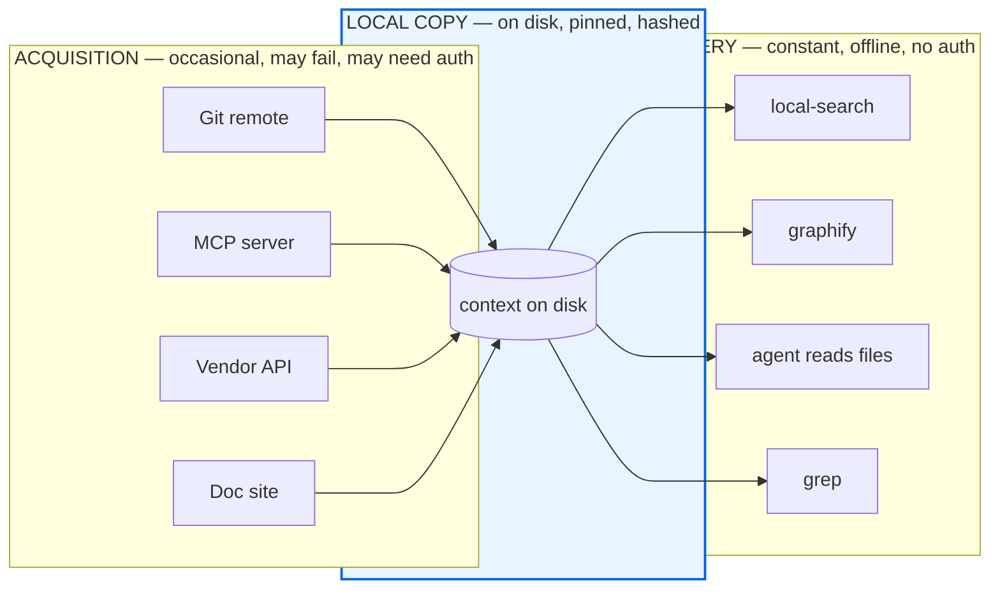
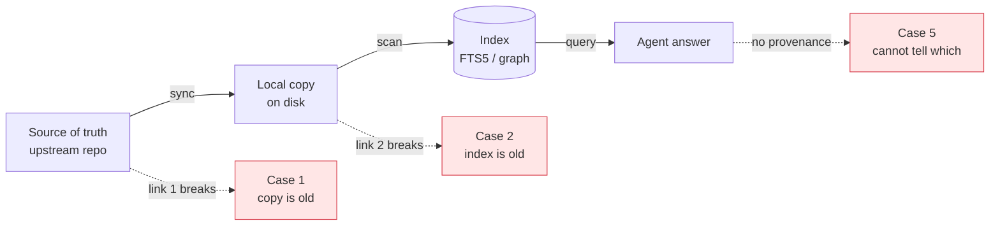
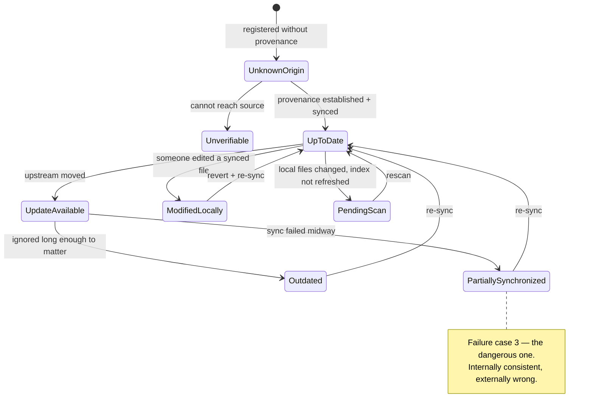
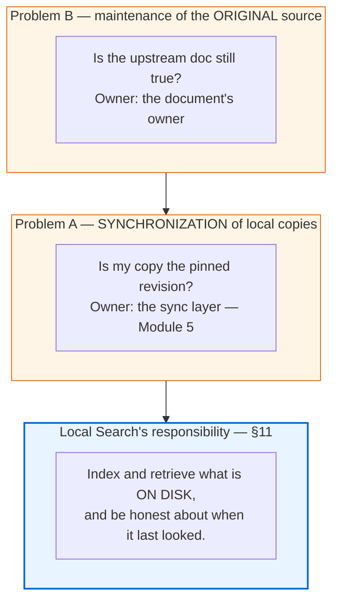
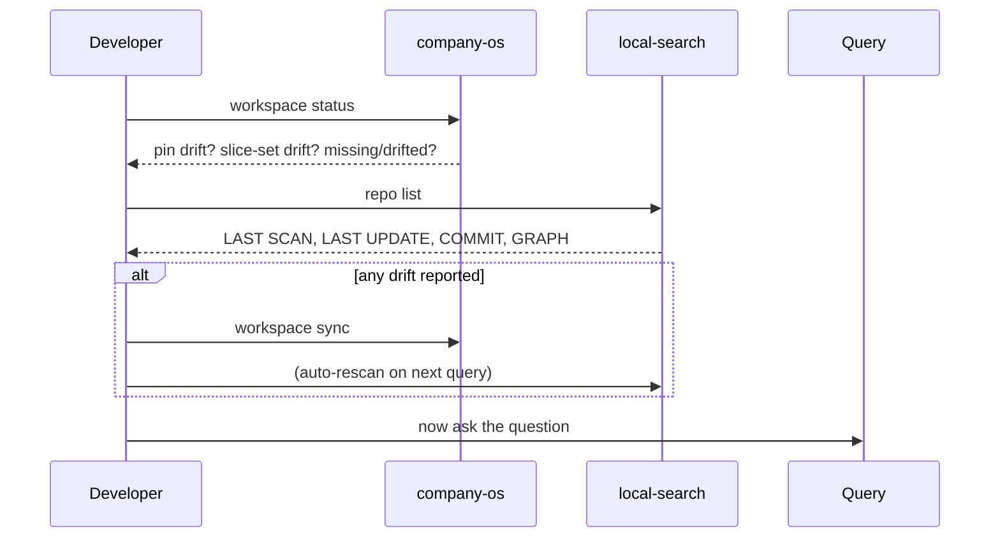

# Module 1 — Local Context Strategy

**Duration:** 15 minutes
**Source:** `.devlocal/local-context/local-context-strategy.md` (§1–15),
`local-context-process-01.md` (§1), `local-context-01.md`

---

## Module purpose

| | |
| --- | --- |
| **Why this module exists** | Every other module assumes context is *on disk and valid*. If that assumption is wrong, Local Search returns confident answers about last quarter's design and Graphify maps a branch nobody merged. This module makes the assumption explicit and testable. |
| **What participants leave with** | The ability to state, for any repo they use, which of seven synchronization states it is in — and whose job it is to fix it. |
| **How it is taught** | One live `local-search repo list` on the facilitator's real machine, read as a diagnostic instrument rather than a status report. |

---

## Step 1 — Name the constraint

### Why

Teams reach for MCP servers as the default context mechanism, then discover
mid-sprint that the agent in front of them cannot use one. The strategy
document opens here on purpose: the constraint is not a preference, it is an
environmental fact you do not control.

### What

From `local-context-process-01.md` §1:

> One of the main challenges of the process is that agents cannot always use
> MCP servers freely or uniformly.

Four named limits:

- **MCP server availability** — the server may simply not be running or reachable.
- **Compatibility** with the agent or model in use.
- **Access permissions**.
- **Authentication**.

### How

Ask the room three questions and count hands:

1. Who has used a coding agent that could not reach an MCP server?
2. Who has had an agent work in one IDE and not another?
3. Who has had a context source behind an SSO wall the agent cannot cross?

The hands are the argument. Do not present this as theory.

---

## Step 2 — Make the decision: keep context locally

### Why

`local-context-strategy.md` §3 draws the distinction that resolves the
constraint:

> MCP as an acquisition mechanism, not necessarily the final query mechanism.

This reframes MCP from "the way agents get context" to "one way context gets
onto disk." Once it is on disk, querying it needs no server, no token, and no
network.

### What

The split between **acquisition** (get it here, occasionally, possibly over
MCP or git or an API) and **query** (read it constantly, locally, offline).



The failure surface is now confined to the left box, and it fails at a time
you choose (sync time) rather than a time you don't (query time, mid-task).

### How

Say the sentence, then show that the tooling already agrees with it:
Local Search **ships no MCP server** — a CLI plus a Claude skill, deliberately.
That is this decision, implemented.

---

## Step 3 — Enumerate what local access buys you

### Why

Participants will suspect "local copy" means "worse copy — a cache, a
degraded mirror." §2 of the strategy doc argues the opposite: local access is
*superior* for several concrete reasons, not merely available.

### What

The eight benefits from §4:

| Benefit | What it means in practice |
| --- | --- |
| **Full access** | You see every file, not the subset an API chose to expose. |
| **Less filtering** | No server-side truncation, pagination, or relevance pre-filter. |
| **Better navigation** | Directory structure, sibling files, git history — all present. |
| **Custom indexing** | You choose the index (FTS5, embeddings, code graph), not the vendor. |
| **Controlled isolation** | Query without leaking the question to a third party. |
| **Search across multiple sources** | One index over N repos that have no shared system. |
| **Independent operation** | Works on a plane, in a locked-down VPC, during an outage. |
| **Reproducibility** | The same query on the same pin returns the same result. |

### How — demo

```bash
local-search repo list
```

Live output from the facilitator machine:

```text
NAME                  ADDED  LAST SCAN  LAST UPDATE  COMMIT    GRAPH
team-os-example-repo  8d     7d         —            —         —
uncle-os              7d     7d         9m           d6a799e   —
squirrel              6d     6d         5d           18d1075   graphify
foyer-platform        6d     6d         —            1133104   —
```

Point at three things:

1. **Four unrelated repos.** Different owners, different remotes, no shared
   system — "logical aggregation of distributed sources" (§6). The sources stay
   distributed; only the *query surface* is unified.
2. **No auth prompt, no network.** Independent operation.
3. **A `COMMIT` column.** Reproducibility — the answer is pinned to a revision.

---

## Step 4 — Introduce the risk that pays for everything

### Why

A local copy trades a *connectivity* problem for a *freshness* problem. §8
calls staleness the **main risk**. Teams that skip this step build a fast index
over stale content and trust it more than they trusted the slow, correct one —
which is strictly worse than where they started.

### What

§9's **chain of information validity**. Context is valid only if every link
holds:



The five failure cases from §9:

| Case | What happened | Symptom the team actually sees |
| --- | --- | --- |
| **1** | Remote source updated, local copy old | Agent answers with last quarter's design, fluently. |
| **2** | Local copy updated, index old | Search misses a file that is visibly on disk. |
| **3** | Partial update | Half the answer is current, half is not — **worst case**, because it is internally consistent. |
| **4** | Wrong branch | Plausible, coherent, and about a feature that was reverted. |
| **5** | Materialized copy without provenance | You cannot determine which of 1–4 you are in. |

### How

Return to the `repo list` output from Step 3. Two repos show `LAST UPDATE: —`.

**Ask the room: is that context valid?**

Nobody can answer, and that inability *is* case 5. Let the silence sit before
moving on — this is the emotional hinge of the module.

---

## Step 5 — Classify: the seven synchronization states

### Why

"Is it fresh?" is a yes/no question, and freshness is not binary. §13 defines
the **minimum** set of states a synchronization layer must be able to report.
Without vocabulary, teams collapse everything to "probably fine."

### What



| State | Meaning | Trust level |
| --- | --- | --- |
| **Up to date** | Copy matches pinned source; index matches copy. | Full |
| **Update available** | Upstream has moved; your copy is a valid older revision. | High, with a date caveat |
| **Pending scan** | Files changed on disk, index not yet refreshed. | Index lags disk |
| **Unknown origin** | No provenance recorded. | None |
| **Unverifiable** | Provenance exists, source unreachable. | Cannot confirm |
| **Outdated** | Known to be behind by a material amount. | Low |
| **Partially synchronized** | Some paths updated, some not. | **Dangerous** |
| **Modified locally** | Someone edited a derived copy. | Broken chain |

### How

Have each participant open a terminal and classify their own repos. Five
minutes, in pairs. Collect two or three answers aloud.

---

## Step 6 — Assign responsibility (the part teams get wrong)

### Why

When context goes stale, blame lands on the search tool, because the search
tool is where the wrong answer surfaced. §10 and §11 separate the concerns so
the fix lands where the fix lives.

### What

§10 names **two different maintenance problems**, and §11 names the narrow
slice that belongs to Local Search:



**Neither Problem A nor Problem B is Local Search's job.**

What Local Search *does* own: it auto-detects changes on every query — git
HEAD plus staged, unstaged, and untracked files, respecting `.gitignore`. That
closes **failure case 2** (index older than copy) and nothing else.

Cases 1, 3, 4, and 5 need a synchronization layer. §12 asks for one. Module 5
shows the shipped implementation.

### How

Draw the three boxes on the whiteboard, then ask: *"Last time context was
wrong, which box was it?"* In most rooms the honest answer is Problem B — the
upstream doc was never updated — and no tool in this workshop fixes that.
Saying so early buys credibility for everything that follows.

---

## Step 7 — Verify before you search

### Why

§15 makes verification a *precondition* of the query, not a periodic chore.
A thirty-second check prevents an hour of confidently wrong work.

### What

The pre-query ritual, and the metadata (§14) that makes it possible: source
identity, pinned revision, sync timestamp, scan timestamp, and per-file
integrity.



### How — demo

```bash
company-os workspace status    # provenance + pin + slice-set drift
local-search repo list         # index freshness per repo
```

**Checkpoint before Module 2:** every participant can (a) name the seven
states, (b) classify their own repos, (c) say which of the three
responsibility boxes owns a given failure.

---

## Common questions

**"Why not just always use MCP?"**
Availability, compatibility, permissions, authentication (§1). And even when
MCP works, it is an acquisition mechanism — you still want the local query
surface for speed, offline use, and reproducibility.

**"Isn't a local copy just a cache?"**
A cache is a performance optimization with a hidden source of truth. This is a
*pinned materialization* with recorded provenance. The difference is §14's
validity metadata — a cache cannot tell you it is stale; this can.

**"How often should we sync?"**
The strategy document does not prescribe a cadence, and neither should you.
Prescribe the *check* instead: `workspace status` before every sync, and sync
when it reports drift.

---

## Facilitator notes

- **The `LAST UPDATE: —` moment is the module.** If your machine happens to
  show everything green, deliberately register a fourth repo and don't scan it.
- **Do not oversell.** This module's honest conclusion is that two of the three
  responsibility boxes are *not* solved by any tool in the workshop. Module 5
  solves Problem A. Problem B is a human discipline.
- **Timing:** Steps 4–6 are the payload. If short on time, compress Step 3 (the
  eight benefits) to the three visible in `repo list`.

**Next:** [Module 2 — Process to Generate Local Context](02-generate-local-context.md)
