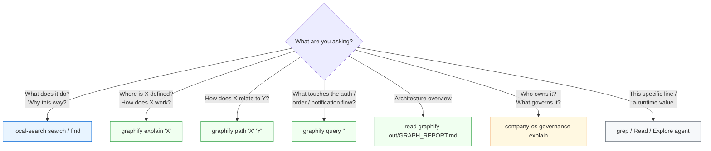
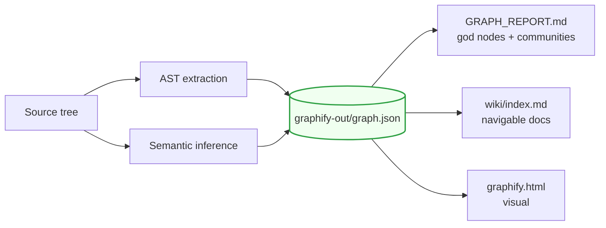
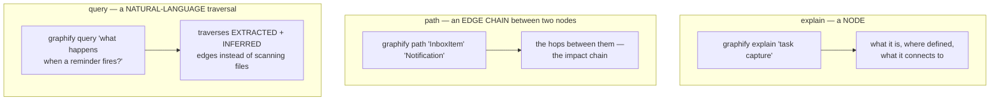
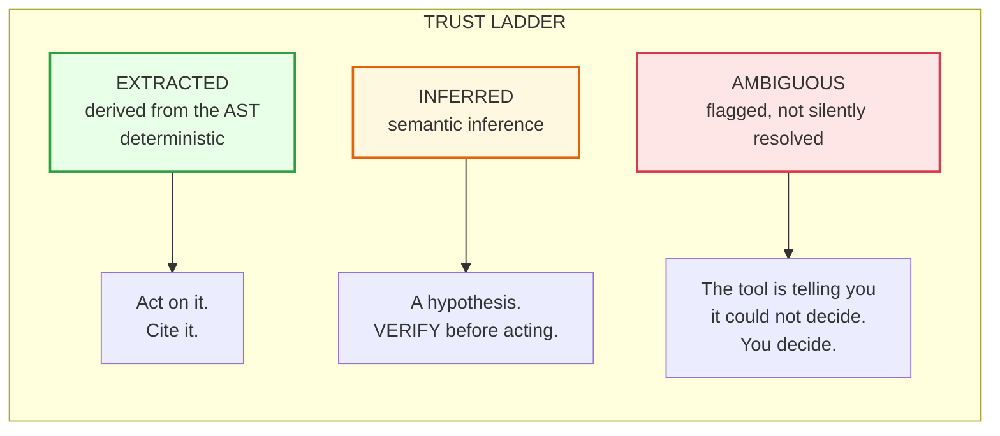
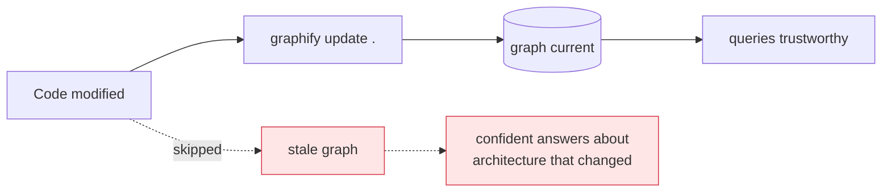
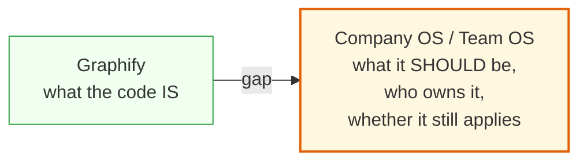

# Module 4 — When to Reach for Graphify

**Duration:** 15 minutes
**Source:** `.devlocal/local-context/context-retrieval-process.md`,
`~/.claude/CLAUDE.md` (graphify-first search rule),
`CLAUDE.md` (project graphify section), verified against `graphify` **0.9.26**

---

## Module purpose

| | |
| --- | --- |
| **Why this module exists** | Participants now have a search tool that works well, so they will use it for everything — including questions it structurally cannot answer. This module draws the line. |
| **What participants leave with** | A decision table they can photograph, plus the habit of checking whether an edge is EXTRACTED or INFERRED before acting on it. |
| **How it is taught** | Ask a question Local Search answers badly, then answer it with `graphify path` in one command. |

---

## The framing sentence

From `context-retrieval-process.md`:

> Local Search and Graphify are **complementary**, not alternatives. Graphify
> does not replace Local Search.

| Tool | Question | Substrate |
| --- | --- | --- |
| **Local Search** | *What does the platform do? Why does it behave this way?* | Specs, PRDs, reality docs, ADRs |
| **Graphify** | *How is it implemented? Which components participate? What does it touch?* | Code — AST + semantic inference |

Local Search tells you the system promises at-least-once delivery. Graphify
tells you which four modules would have to change if that promise changed.
Neither is sufficient.

---

## Step 1 — Learn the decision table

### Why

Tool choice made per-question, from a table, is reliable. Tool choice made from
habit is not. This is the artifact participants should photograph.

### What



| The question | First tool |
| --- | --- |
| "What does the platform do / why does it behave this way?" | **Local Search** |
| "Where is X defined / how does X work?" | `graphify explain "X"` |
| "How does X relate to Y?" | `graphify path "X" "Y"` |
| "What touches the auth / order / notification flow?" | `graphify query "<question>"` |
| "Give me the architecture overview" | read `graphify-out/GRAPH_REPORT.md` |
| "Who owns this / what governs it?" | **Company OS / Team OS** |

### The fallback rule — state it precisely

Fall back to grep, `Read`, or an Explore agent **only if**:

- `graphify-out/graph.json` does not exist, **or**
- the question is about a **specific line of code or a runtime value** — not
  architecture or structure.

### How

Run the negative demo first. Ask Local Search a structural question:

```bash
local-search search "what calls the notification dispatcher"
```

You get documents *mentioning* dispatch. You do not get the call graph. Let
participants feel the mismatch — then answer it properly in Step 3.

---

## Step 2 — Build the graph

### Why

The decision table's fallback condition is *"`graph.json` does not exist."* So
the first move in any repo is to check, and build if missing.

### What



| Artifact | Read it when |
| --- | --- |
| `graph.json` | Never directly — it backs `explain`/`path`/`query` |
| `GRAPH_REPORT.md` | **First**, before any architecture question |
| `wiki/index.md` | Navigating a repo you don't know — use instead of raw files |
| `graphify.html` | Showing structure to a human |

### How — demo

```bash
ls graphify-out/          # does the graph exist?
graphify .                # full build: AST + semantic inference
graphify update .         # incremental — AST-only, no API cost
```

`local-search repo list` tells you which repos already have one:

```text
NAME       ADDED  LAST SCAN  LAST UPDATE  COMMIT    GRAPH
squirrel   6d     6d         5d           18d1075   graphify
uncle-os   7d     7d         9m           d6a799e   —
```

**Practical warning:** a full `graphify .` build on a large repo is not a
15-minute-module operation. Run it during the break, or demo on a repo that
already has a graph — `squirrel` in this environment.

---

## Step 3 — Read the report before you query

### Why

The project `CLAUDE.md` makes this a standing rule:

> Before answering architecture or codebase questions, read
> `graphify-out/GRAPH_REPORT.md` for **god nodes** and **community structure**.

Querying without it is like grepping without knowing the directory layout. The
report tells you which nodes are hubs (touch everything, change carefully) and
which communities exist (the real module boundaries, as opposed to the
directory names).

### What

| Concept | What it means | Why you care |
| --- | --- | --- |
| **God node** | A node with disproportionate connectivity | Changing it has blast radius; it is also where bugs concentrate |
| **Community** | A cluster of densely-connected nodes | The *actual* module boundary, which may not match folders |

### How — demo

```bash
head -60 graphify-out/GRAPH_REPORT.md
```

Ask the room: *"Do these communities match your folder structure?"* When they
don't — which is common — that divergence is itself a finding worth taking back
to the team.

If `wiki/index.md` exists, navigate it instead of reading raw files.

---

## Step 4 — The three query verbs

### Why

Three verbs cover three distinct shapes of structural question. Knowing which
verb fits is most of the skill.

### What



| Verb | Shape of question | Example |
| --- | --- | --- |
| `explain` | About **one** thing | "Where is X defined, how does it work?" |
| `path` | About **two** things | "How does X relate to Y?" — impact analysis |
| `query` | About a **flow** | "What touches the notification flow?" |

### How — demo

```bash
cd ~/others/metuur/adhd/squirrel      # the repo with GRAPH = graphify

graphify explain "task capture"
graphify path "InboxItem" "Notification"
graphify query "what happens when a reminder fires?"
```

Now return to Step 1's failed Local Search query and answer it with `path`. The
contrast in a single command is the module's payoff.

**The `path` verb is the one that changes behaviour.** It is impact analysis
before a refactor: *"if I change X, what else is on the chain to Y?"* — a
question grep cannot answer at all, because the answer is a traversal, not a
string.

---

## Step 5 — EXTRACTED vs INFERRED — the honesty layer

### Why

**This is the most important step in the module.** A graph that presents guesses
and facts identically is worse than no graph — it launders inference into
apparent certainty. Graphify labels every edge, and the label changes what you
are entitled to do with it.

### What



| Label | Origin | Trust | What you may do |
| --- | --- | --- | --- |
| **EXTRACTED** | AST — deterministic | High | Act on it, cite it in a PR |
| **INFERRED** | Semantic inference | Medium | Treat as a hypothesis; open the file and confirm |
| **AMBIGUOUS** | Could not be resolved | — | The tool declined to guess. Resolve it yourself. |

### How

Run a `query` and read the edge labels in the output. Then say the rule:

> **An INFERRED edge is a hypothesis to verify, not a fact to cite.**

Have participants find one INFERRED edge and open the file to check it. Half
the room will find it correct and half will find it approximate — which is
exactly the calibration the label exists to produce.

**Why this matters beyond Graphify:** it is the same discipline as Module 1's
validity metadata. A tool that reports its own confidence can be trusted; a
tool that reports everything with equal confidence cannot.

---

## Step 6 — Keep the graph current

### Why

Module 1's staleness problem, applied to a derived artifact. A graph built
three weeks ago describes three-week-old architecture, and — unlike a stale
doc — it *looks* freshly generated.

### What

From the project `CLAUDE.md`:

> After modifying code files in this session, run `graphify update .` to keep
> the graph current (**AST-only, no API cost**).



| Command | Cost | When |
| --- | --- | --- |
| `graphify .` | Full — AST + semantic inference | First build; after major restructuring |
| `graphify update .` | Cheap — AST only, no API cost | After any code change, every session |

### How

Make it a session-closing habit alongside `company-os graph build`:

```bash
graphify update .          # code changed
company-os graph build     # frontmatter changed
```

---

## The honest limitation

End the module here, because it sets up Module 5:

> Graphify knows what the code **is**. It does not know what the code was
> **supposed to** be, who owns it, or whether the requirement it implements is
> still in force.



That gap is precisely where Module 5 begins.

---

## Common questions

**"Isn't Graphify just a smarter grep?"**
Grep finds strings. Graphify traverses EXTRACTED + INFERRED edges and tells you
which is which. `path "X" "Y"` has no grep equivalent — the answer is a
traversal, not a match.

**"When do I go back to grep?"**
Two cases only: no `graph.json`, or you want a specific line / runtime value.
Structure questions go to the graph.

**"How expensive is keeping it current?"**
`graphify update .` is AST-only with no API cost. The full build is the
expensive one; you run it rarely.

**"Can I trust INFERRED edges?"**
Trust them as leads. Verify before citing. That is what the label is for.

---

## Facilitator notes

- **The negative demo in Step 1 earns the module.** Show Local Search failing at
  a structural question before showing Graphify succeeding. Order matters.
- **Step 5 is non-negotiable.** If you cut anything, cut Step 3. A room that
  learns the verbs but not the trust ladder will cite inference as fact.
- **Pre-build your demo graph.** Do not run a full `graphify .` on stage.
- **Have the boundary sentence memorized:** *"Graphify knows what the code is,
  not what it was supposed to be."* It is the transition into Module 5.

**Previous:** [Module 3 — Retrieving Context with Local Search](03-local-search-retrieval.md)
**Next:** [Module 5 — Company OS & Team OS as the Retrieval Substrate](05-company-os-team-os.md)
