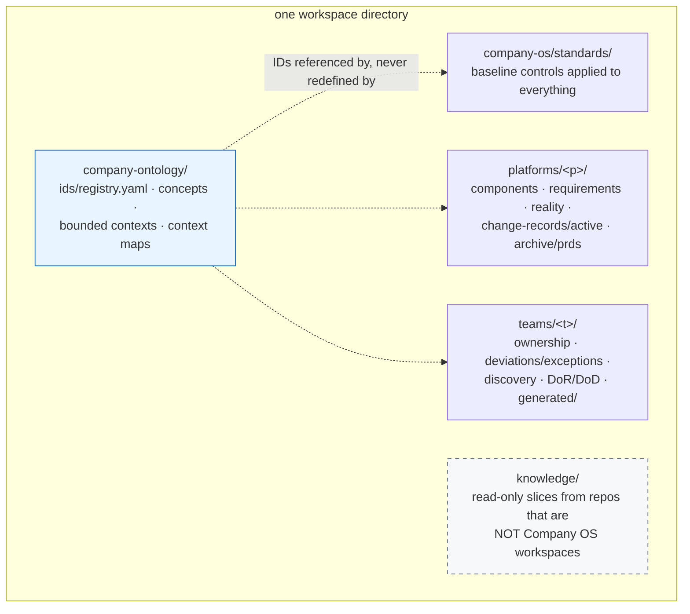
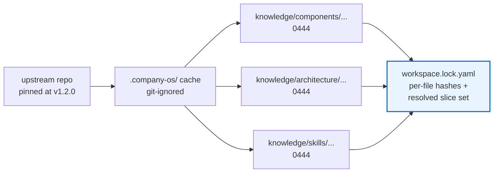
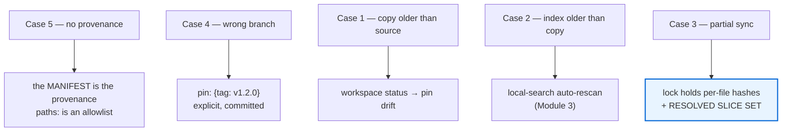
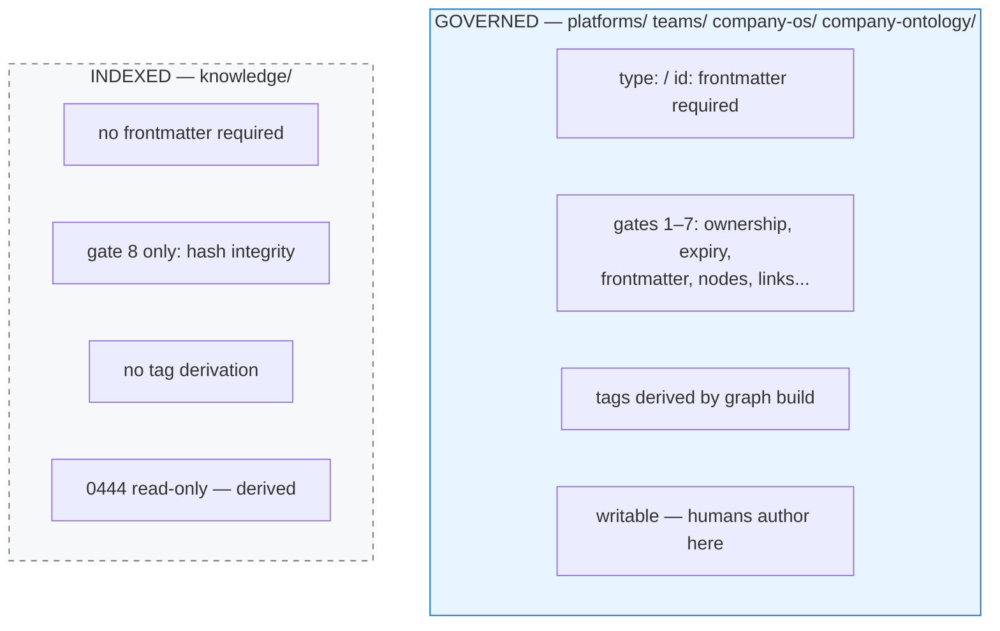
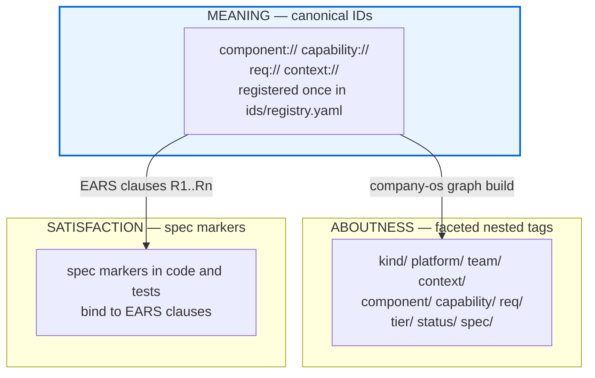
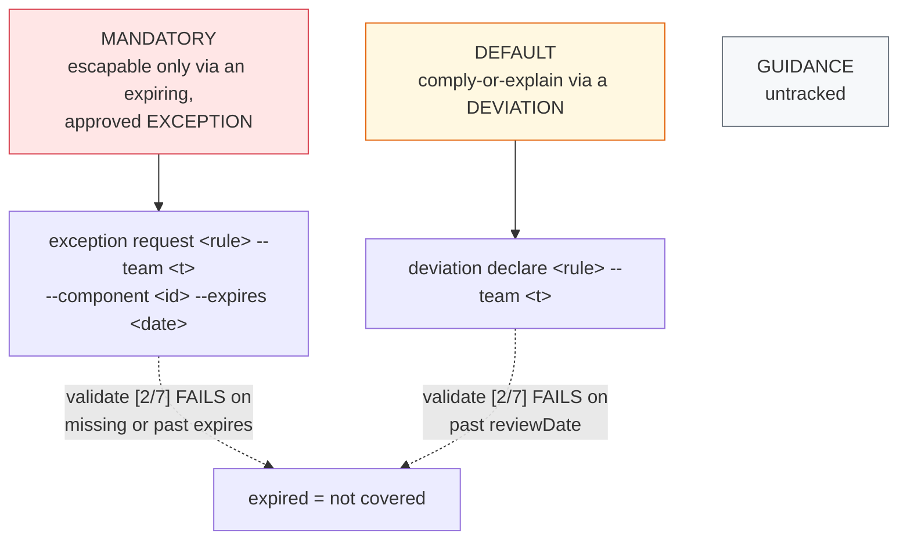
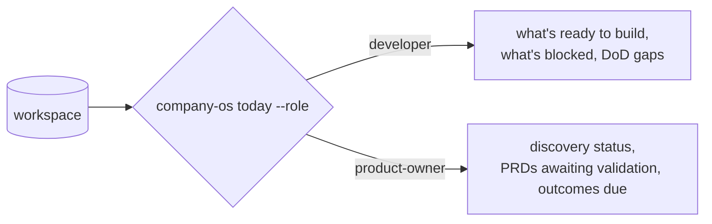

# Module 5 — Company OS & Team OS as the Retrieval Substrate

**Duration:** 15 minutes
**Source:** `company-os-starter/docs/user-guide/how-to/sync-a-knowledge-catalog.md`,
`docs/ONTOLOGY-GUIDE.md`, `CLAUDE.md`, `FEDERATION-RUNBOOK.md`

---

## Module purpose

| | |
| --- | --- |
| **Why this module exists** | Module 1 ended with an unsolved problem: *who synchronizes the local copies?* (§12 asks for a layer; no tool in Modules 3–4 provides one.) Module 4 ended with another: *who owns this, and does the requirement still apply?* This module answers both. |
| **What participants leave with** | A `workspace.yaml` they could commit tomorrow, and the "indexed, not governed" rule. |
| **How it is taught** | Write a manifest, sync it, hand-edit a synced file on purpose, and watch gate `[8/8]` name the file. |

---

## Step 1 — See the layers as a retrieval surface

### Why

Company OS is usually introduced as *governance*. In this workshop it is
introduced as **the thing that makes context addressable, owned, and current** —
which is a retrieval concern, not a compliance one.

### What

A workspace is one directory with four authored peer roots, plus an optional
fifth synced one.



| Layer | What it makes retrievable |
| --- | --- |
| `company-os/standards/` | The baseline controls applied to everything |
| `platforms/<p>/` | Component descriptors, requirements, **reality**, active PRDs, archived outcomes |
| `teams/<t>/` | Ownership, deviations/exceptions, discovery, definition of ready/done |
| `company-ontology/` | Canonical IDs — the vocabulary everything else refers to |
| `knowledge/` | Read-only documentation slices synced from foreign repos |

**Platforms are "teams" relative to Company OS** — the same tier and deviation
model applies at every level. That is what makes the model scale without a new
concept per layer.

### How

```bash
cd examples/workspace
ls
```

Five directories. Point at each and name the question it answers.

---

## Step 2 — `knowledge/` — the synchronization layer §12 asked for

### Why

**This is the direct, shipped answer to Module 1.** Component repos hold
documentation you want an agent to read — `docs/sdd`, `specs/`,
`architecture/` — mixed in with source code you do not. A knowledge slice pulls
only the documentation directories in, pinned and hash-locked, without cloning
or indexing the rest.

### What

Declare it in `workspace.yaml` at the workspace root:

```yaml
version: 1
repos:
  - name: component-library
    url: https://github.com/acme/component-library.git
    pin: {tag: v1.2.0}
    slices:
      - {paths: [docs/sdd],       localDirectory: knowledge/components/component-library}
      - {paths: [architecture],   localDirectory: knowledge/architecture/component-library}
      - {paths: [.claude/skills], localDirectory: knowledge/skills/component-library}
```

One repo, one clone, one cache, three destinations. A repo contributing a
single area can use the flat form — `localDirectory:` and `paths:` directly on
the entry, no `slices:` key.



### How — demo

```bash
company-os workspace status    # ALWAYS before a sync
company-os workspace sync      # materialize slices + write workspace.lock.yaml
company-os graph build         # refresh knowledge/CLAUDE.md so agents can find it
company-os validate
```

Requires a `workspace.yaml` manifest and **git ≥ 2.27**.

**Commit three things together:** the manifest, the materialized slices, and
`workspace.lock.yaml`. The lock diff is the record of which content moved.

### Two rules the CLI enforces

| Rule | Why |
| --- | --- |
| **Target an area, not the catalog root.** `localDirectory: knowledge` is refused. | `knowledge/` itself holds the generated context node. |
| **Targets must not overlap.** Equal or nested destinations are refused across the whole manifest. | The outer slice's read-only pass would freeze the inner one and break the next sync. |

`paths:` is an **allowlist, not a filter** — there is no exclude form. Anything
not named is never copied, which is what keeps source code out. The path below
the destination mirrors the source, so `paths: [docs/sdd]` into
`knowledge/components/component-library` lands at
`knowledge/components/component-library/docs/sdd/...`. There is no rename — if
you want a different shape locally, change it upstream.

---

## Step 3 — Map it back to Module 1's failure cases

### Why

This is the moment the workshop becomes one argument instead of five tool
demos. Every mechanism in Step 2 exists to close a specific failure case.

### What



| Module 1 failure | Mechanism that closes it |
| --- | --- |
| **Case 1** — remote updated, copy old | `workspace status` reports **pin drift** |
| **Case 2** — copy updated, index old | Local Search auto-rescan (Module 3, Step 7) |
| **Case 3** — partial update | Lock records per-file hashes **and** the resolved slice set |
| **Case 4** — wrong branch | Pins are explicit tags, committed with the manifest |
| **Case 5** — no provenance | The manifest *is* the provenance |

### The subtle one — say this slowly

`workspace status` reports exactly three kinds of drift:

- **pin drift** — the manifest pin no longer matches the lock (you edited the
  pin; sync to apply it)
- **slice-set drift** — a target or allowlist changed without a re-sync.
  **Worth knowing about because the old files still exist and still hash
  clean, so the file-level check alone would report green.**
- **missing / drifted slices** — files absent, or hand-edited

That middle case is why the lock records the *slice set* and not just hashes.
It is Module 1's case 3 — internally consistent, externally wrong — caught by
design.

### How — demo the enforcement

```bash
chmod +w knowledge/components/component-library/docs/sdd/some-doc.md
echo "sneaky edit" >> knowledge/components/component-library/docs/sdd/some-doc.md
company-os validate
```

Gate `[8/8]` fails and **names the file**. Slices land `0444`/`0555` — you had
to `chmod` to even attempt it.

> **Never edit a synced file.** The fix is always upstream — change the source
> repo, cut a new pin, re-sync.

To take a new upstream release: bump `pin:`, `sync`, `graph build`, commit.

---

## Step 4 — Indexed, not governed

### Why

Participants will ask why `knowledge/` gets a different rulebook. The answer is
a genuine design decision with a clear boundary, and stating it prevents people
from dumping governed documents into the catalog.

### What

| `knowledge/` **gets** | `knowledge/` **skips** |
| --- | --- |
| A generated `CLAUDE.md` context node listing every area and document | `graph build` tag derivation |
| Cross-links from every sibling root | Validate gates `[1/8]`–`[7/8]` |
| Gate `[8/8]` hash integrity | — |



**The reason, precisely:** knowledge slices come from repos that are not
Company OS workspaces. Their docs carry no `type:`/`id:` frontmatter, so the
frontmatter gate would reject every one of them; and the materialized slice is
`0444`, so tag rewriting would fail against read-only files. The catalog is
there for an agent to read, not for the governance gates to police.

### How — the rule for the whiteboard

> If you want a document **governed** — owned, reviewed, expiring — it belongs
> in a platform or team root as a normal artifact, **not in the catalog**.

Ask the room to classify three of their own documents: governed, or indexed?
The disagreements are the useful part.

---

## Step 5 — The correlation layer: IDs → tags → `@spec`

### Why

Module 2 generated these. Here they do their job: making context retrievable
*across* directories, platforms, and teams. Directories give you one hierarchy;
this gives you every other slice.

### What

Three mechanisms, one rule — **IDs are canonical; tags and wikilinks are
derived.**



The full tag namespace:

```text
#kind/prd  #kind/adr  #kind/reality  #kind/discovery  #kind/skill  #kind/outcome
#platform/communications
#team/customer-engagement
#context/communications
#component/customer-notification-service
#capability/message-delivery
#req/communications/delivery-reliability
#tier/mandatory   #tier/default   #tier/guidance
#status/active    #status/completed   #status/deprecated
#spec/communications/delivery-reliability
```

### How — demo the composition

Each axis is a facet; nested-tag search composes them:

```text
tag:#capability/message-delivery tag:#kind/prd            → every PRD ever touching the capability
tag:#team/customer-engagement tag:#tier/mandatory         → the team's mandatory surface
tag:#component/customer-notification-service -tag:#status/completed → live work on the component
```

```bash
company-os ids list        # canonical IDs
company-os graph build     # re-derive tags + wikilinks
grep -rn "@spec req://" .  # satisfaction bindings
```

**The rule:** never hand-write `tags:`. Set the frontmatter fields and run
`graph build` — a hand-edited tag is overwritten on the next build.

In an assembled Obsidian vault (every OS repo mounted as a folder), tags plus
wikilinks turn the federation into one navigable graph. That is the same
correlation surface the agent uses.

> **Scope note:** `docs/ONTOLOGY-GUIDE.md` describes `validate --ontology` and
> `spec trace` as the *target design*. The CLI today implements `graph build`
> and the core `validate` gate. Treat the guide as the roadmap and the CLI as
> ground truth. Say this in the room — overselling here costs credibility.

---

## Step 6 — Governance answers "does this still apply?"

### Why

Module 4's closing gap: Graphify knows what the code *is*, not whether the
requirement it implements is still in force. Rules expire. Exceptions lapse.
Retrieval that ignores this returns *technically present, practically void*
context.

### What

Three tiers, and what escaping each one costs:



| Tier | Escape hatch | Enforcement |
| --- | --- | --- |
| **mandatory** | Expiring, approved exception | `resolve_team_governance` **rejects** any deviation aimed at a mandatory rule |
| **default** | Deviation (comply-or-explain) | `validate [2/7]` fails on a past `reviewDate` |
| **guidance** | None needed — untracked | — |

**Mandatory rules must be written as verifiable outcomes, not
implementations.** That is what preserves team flexibility while keeping the
control real — the design intent stated as *strict on artifacts, flexible on
process*.

### How — demo

```bash
company-os governance resolve --team customer-engagement
company-os governance explain <component>      # WHY does this rule apply here?
company-os deviation declare <rule> --team <t>
company-os exception request <rule> --team <t> --component <id> --expires <date>
```

`governance explain` is the retrieval command: it answers *why does this rule
apply to this component* by tracing the merge of company baseline + platform
requirements + team deviations.

**Never hand-edit `teams/<t>/generated/effective-governance.yaml`.** It is
produced by `governance resolve`; CI regenerates and diffs it.

---

## Step 7 — Retrieval scoped to a person

### Why

The final narrowing. The same workspace, ranked for who is asking — a developer
and a product owner facing the same repo need different context.

### What



### How — demo

```bash
company-os today --role developer
company-os today --role product-owner
company-os check ready --team <t> --components <id,...>
company-os check done  --team <t> --components <id,...>
company-os skills list      # merged four-layer skill view
```

**On skills:** each `skills/*/SKILL.md` step is tagged `(mandatory)` /
`(default)` / `(guidance)`. On conflict, canonical mandatory steps win over
personal rules in `scratchpad/personal-rules/` — **and the agent should say so**.
That is retrieval with an explicit precedence order, which is what makes an
agent's behaviour auditable.

---

## Step 8 — In CI

### Why

Everything above is worthless if it only holds on the facilitator's laptop.

### What

The committed slices and lock are already on disk after checkout, and gate
`[8/8]` is a pure hash check with no network and no git cache. So CI needs
nothing more than:

```yaml
- name: install company-os        # one static binary, no runtime dependency
  env: {COMPANY_OS_VERSION: v1.0.0}
  run: |
    curl -fsSLo /usr/local/bin/company-os \
      <release-url>/$COMPANY_OS_VERSION/company-os_${COMPANY_OS_VERSION}_linux_amd64
    chmod +x /usr/local/bin/company-os
- run: company-os --root . validate
```

### How

**Do not use `sync --frozen` in CI.** It rebuilds from the local
`.company-os/` cache, which is git-ignored and therefore absent on a clean
runner. Validate the committed slices directly.

Workspace root resolution order: `--root` flag → `$COMPANY_OS_WORKSPACE_ROOT` →
current directory.

---

## Common questions

**"Can I edit a file in `knowledge/`?"**
No. `0444`, and gate `[8/8]` names the file when you try. Fix upstream.

**"Why isn't `knowledge/` governed?"**
Foreign docs have no `type:` frontmatter and the slice is read-only. Governing
it would fail every gate for structural reasons, not quality ones.

**"Where do code repos fit?"**
They don't — deliberately. The only binding is grep-able `@spec` markers in
tests (Module 2, Step 4).

**"Do I need `workspace.yaml` to use Company OS?"**
No. Federation is optional (Phase 4). The four authored roots work standalone;
`knowledge/` is the fifth, synced, optional one.

**"What if the ontology guide describes something the CLI can't do?"**
The guide is the roadmap; the CLI source is ground truth. `validate --ontology`
and `spec trace` are target design, not shipped.

---

## Facilitator notes

- **Step 3 is the workshop's closing argument.** Do not cut it. Mapping the
  five failure cases to five mechanisms is what makes 90 minutes cohere.
- **Do the hand-edit demo live.** `chmod +w`, append a line, `validate`. Gate
  `[8/8]` naming the file is more persuasive than any slide.
- **Be honest about the roadmap gap in Step 5.** Participants who later discover
  `spec trace` doesn't exist will discount everything else you said.
- **Timing:** Steps 7–8 are the first to cut. Steps 2–4 must survive.

**Previous:** [Module 4 — When to Reach for Graphify](04-graphify-retrieval.md)
**Next:** [README — index and the retrieval sequence](README.md)
