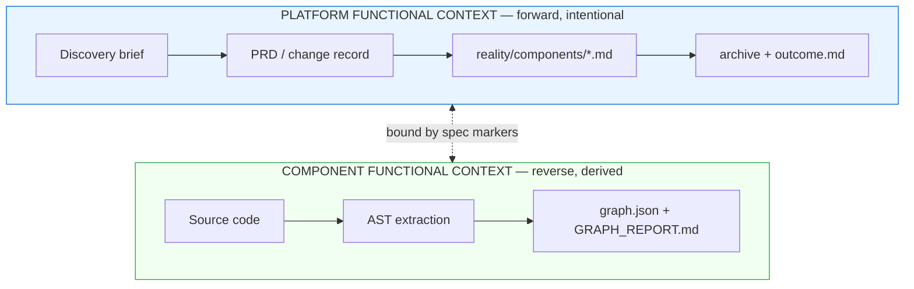
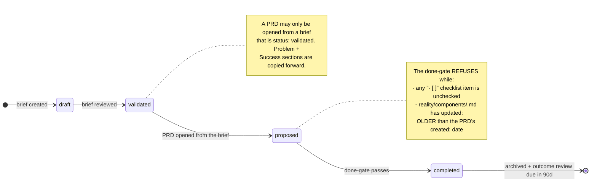
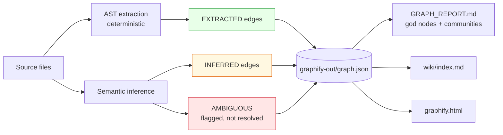
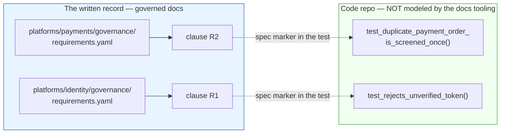
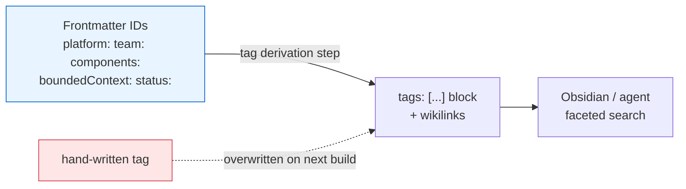
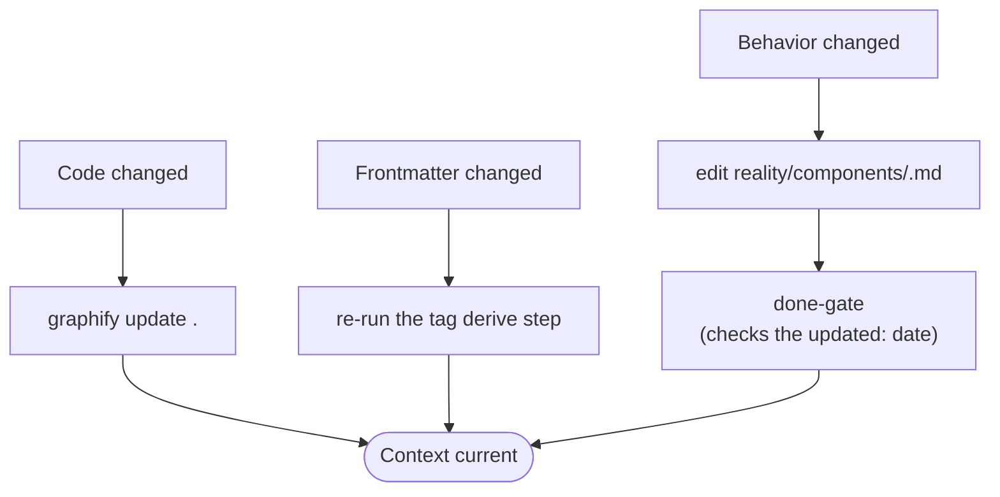

# Module 2 — Process to Generate Local Context

**Duration:** 20 minutes
**Source:** `.devlocal/local-context/local-context-02.md`,
`docs/ONTOLOGY-GUIDE.md`,
`examples/banking/bank/repos/code-transaction-screening/tests/test_settlement_finality.py`

---

## Module purpose

| | |
| --- | --- |
| **Why this module exists** | Module 1 assumed context exists. It usually doesn't — or it exists at one level only. Teams document *what the platform promises* or *what the code does*, rarely both, and almost never with a link between them. |
| **What participants leave with** | The two-level model, the commands that produce each level, and the `@spec` marker that binds them. |
| **How it is taught** | Show the artifact shapes, run the scaffolding commands, then `grep` a real test file and watch a requirement clause resolve to a test function. |

---

## Step 1 — Understand the two levels

### Why

`local-context-02.md` opens with the split because the two levels are produced
by different people, at different times, with different methods — and they
drift apart silently. Naming them separately is what makes the drift visible.

### What

> The process maintains two levels of documentation that serve different
> purposes but must remain connected:
>
> 1. **Platform functional context**, built from requirements, features, flows,
>    and experiences.
> 2. **Component functional context**, built through reverse engineering from
>    the source code.
>
> The platform context describes the experience and general behavior that the
> platform offers its users.



| | Platform context | Component context |
| --- | --- | --- |
| **Direction** | Forward — intent, then build | Reverse — code, then describe |
| **Author** | Humans (PO, tech lead) | Derived by tooling |
| **Answers** | *What does it promise? Why?* | *What does it actually do?* |
| **Lives in** | `platforms/`, `teams/` | `graphify-out/` |
| **Goes stale when** | Reality changes and nobody edits the doc | Code changes and nobody re-runs the graph |
| **Refreshed by** | a done-gate in CI + human review | `graphify update .` |

### How

Ask: *"Which level does your team have?"* Most rooms have one. The gap between
the two is where every "the docs lied to me" incident originates.

---

## Step 2 — Generate platform functional context

### Why

Platform context is only trustworthy if its lifecycle is enforced. A spec that
can be marked done without updating the reality doc produces documentation that
describes a plan, not a system — and Module 1's failure case 1 at scale.

### What

The artifact locations, and the lifecycle your pipeline has to enforce:



| Stage | Location | Visibility |
| --- | --- | --- |
| Discovery brief | `docs/product/discovery/` | Team-private |
| Active PRD | `docs/change-records/active/` | Platform-visible |
| Reality doc | `docs/reality/components/<id>.md` | Current-state truth |
| Archive | `docs/archive/prds/` + `outcome.md` | Historical |

### How — demo

Show the shapes before showing the process:

```bash
ls docs/product/discovery/
ls docs/change-records/active/
ls docs/reality/components/
```

Then walk one brief all the way through: write it, review it to
`status: validated`, open a PRD from it, and try to close the PRD.

**Demo the refusal, not the success.** Try to close the PRD *before* touching
the reality doc, and let the gate fail. The failure message is the lesson:

> **A change is done only when reality is updated.**

An override always exists in practice. Say that it exists, and that using it is
a decision someone owns.

State the mechanics once, because they are unglamorous on purpose: the gate is a
checkbox scan and a date comparison. Any team can build it in an afternoon. The
value is in the refusal, not in the tool that issues it.

---

## Step 3 — Generate component functional context

### Why

Nobody hand-writes an accurate description of a 200-file service, and nobody
maintains one. Component context must be *derived* or it will be wrong within a
sprint. This is `local-context-02.md`'s "reverse engineering from the source
code."

### What

Graphify walks the AST, extracts entities and relationships, adds semantic
inference on top, and writes a set of local artifacts.



| Artifact | What it is for |
| --- | --- |
| `graph.json` | The graph itself — queried by `explain` / `path` / `query` |
| `GRAPH_REPORT.md` | Architecture overview: god nodes, community structure |
| `wiki/index.md` | Navigable doc surface — read this instead of raw files |
| `graphify.html` | Visual exploration |

### How — demo

```bash
graphify .           # full build: AST + semantic inference
ls graphify-out/
graphify update .    # incremental refresh — AST-only, no API cost
```

Verified in this workshop's environment: `graphify 0.9.26`. In
`local-search repo list`, the `squirrel` repo shows `GRAPH = graphify` — that
column is how you tell, at a glance, which repos have component context.

**The discipline to state now, enforced by the project `CLAUDE.md`:** after
modifying code files in a session, run `graphify update .`. Same rule as
Module 1 — a derived artifact that isn't refreshed is a stale artifact.

---

## Step 4 — Bind the two levels: `@spec` markers

### Why

**This is the most important five minutes of the workshop.** Two levels of
documentation that are merely *consistent* drift. Two levels that are
*mechanically linked* can be checked. The link has to survive every language,
every CI system, and ten years — so it is plain text.

### What

Platform requirements carry numbered **EARS clauses** (`R1…Rn`). Code and tests
bind back to them with grep-able comment markers.

```text
@spec req://<platform>/<requirement>@<version>#<clause>
       └─ payments  └─ settlement-finality └─1.0  └─ R2
```



The pattern, from a real test file —
`examples/banking/bank/repos/code-transaction-screening/tests/test_settlement_finality.py`:

```python
"""Consumer-side conformance tests for the screening service.

Code repos are NOT modeled by the docs tooling. The only binding back to
governance is grep-able @spec markers tying tests to EARS clauses.
"""


# @spec req://payments/settlement-finality@1.0#R2
def test_duplicate_payment_order_is_screened_once():
    """R2: a duplicated Payment Order event must not produce a second Alert."""
    ...


# @spec req://identity/token-verification@1.0#R1
def test_rejects_unverified_token():
    """R1: every inbound call without a verifiable token is rejected."""
    ...
```

The design intent, from the project `CLAUDE.md`:

> A mandatory clause with zero test-side `@spec` sites is meant to block
> completion.

### How — demo

Traverse the link in both directions, live:

```bash
# Requirement -> tests that satisfy it
grep -rn "@spec req://payments/settlement-finality" .

# Every binding in the example
grep -rn "@spec req://" examples/banking/

# Which clauses have NO test bindings? (the gap that should block completion)
grep -rn "@spec req://" examples/banking/ | sed 's/.*#//' | sort -u
```

### The point to land

Code repos are **deliberately not modeled** by the docs tooling. There is no
plugin, no adapter, no registry of source files. The marker is the entire
integration surface.

**Why that is a feature, not a shortcut:** grep works in every language, every
editor, every CI runner, offline, forever. A richer integration would work in
fewer places and break more often.

---

## Step 5 — Derive the correlation layer

### Why

Generated context is only retrievable if it is *addressable across
directories*. Directories give you one hierarchy; you need every other slice —
"all mandatory requirements touching message-delivery, across every platform
and team." That is what tags provide, and hand-written tags drift instantly.

### What

Three mechanisms, one rule: **IDs are canonical; tags and wikilinks are
derived.**



The tag namespace:

```text
#kind/prd  #kind/adr  #kind/reality  #kind/discovery  #kind/skill  #kind/outcome
#platform/communications
#team/customer-engagement
#context/communications
#component/customer-notification-service
#capability/message-delivery
#req/communications/delivery-reliability
#tier/mandatory   #tier/default   #tier/guidance
#status/active    #status/completed   #status/deprecated
#spec/communications/delivery-reliability
```

### How — demo

Two pieces, both of which a team owns:

1. a **derive step** that reads frontmatter across the doc tree and rewrites the
   `tags:` block
2. a **check step** in CI that re-derives and fails the build if the committed
   tags differ from the fresh derivation

Show the canonical ID list first, so the derivation has a visible source:

```bash
cat ids/registry.yaml
```

Then compose facets — this is retrieval across directories, platforms, teams:

```text
tag:#capability/message-delivery tag:#kind/prd            → every PRD ever touching the capability
tag:#team/customer-engagement tag:#tier/mandatory         → the team's mandatory surface
tag:#component/customer-notification-service -tag:#status/completed → live work on the component
```

**The rule, stated flatly:** never hand-write `tags:`. Set the source
frontmatter fields and re-run the derive step. Editing a tag by hand is futile —
the next build overwrites it. The CI check exists to make that futility loud
instead of silent, and it is the same pattern you should apply to every derived
file in the tree.

---

## Step 6 — Keep both levels current

### Why

Both levels are derived or gated, and both go stale by default. Closing the
module here connects it back to Module 1: generation is not a one-time act.

### What



| Trigger | Command | Enforced by |
| --- | --- | --- |
| Code files modified | `graphify update .` | Project convention (`CLAUDE.md`) |
| Frontmatter changed | re-run the tag derive step | CI re-derives and diffs |
| Behavior changed | edit the reality doc | done-gate date check |

### How

End the module by running all three in sequence, then running the docs CI gate
locally. A clean exit is the module's checkpoint — and the habit worth copying
home is that the checkpoint is a command, not a code review comment.

---

## Common questions

**"Do I write the reality doc before or after the code?"**
The gate only checks that `reality/components/<id>.md` has an `updated:` date
*newer than the PRD's `created:` date*. The order is yours; the freshness is
not.

**"What if there's no test for a mandatory clause yet?"**
That is the gap the design intends to surface. Write the test with the marker
first — the marker is a comment, it costs nothing, and it makes the clause
traceable before the implementation exists.

**"Can Graphify generate the platform context too?"**
No, and it shouldn't. Graphify describes what the code *is*. Platform context
records what it was *supposed to* be and why. If the two were generated from
the same source, comparing them would be meaningless.

---

## Facilitator notes

- **Step 4 must survive any time cut.** If you are behind schedule, drop Step
  2's full lifecycle demo and Step 5's tag composition — but `grep -rn "@spec
  req://"` is the moment the two-level model becomes concrete.
- **Run the done-gate failure deliberately.** A passing demo teaches
  syntax; a refusing demo teaches the invariant.
- **Expect pushback on "no plugin for code repos."** Have the grep-works-
  everywhere argument ready; it lands better than defending the architecture.

**Previous:** [Module 1 — Local Context Strategy](01-local-context-strategy.md)
**Next:** [Module 3 — Retrieving Context with Local Search](03-local-search-retrieval.md)
