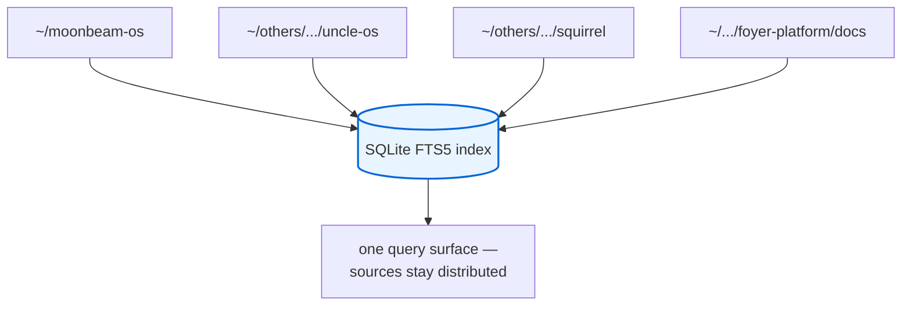
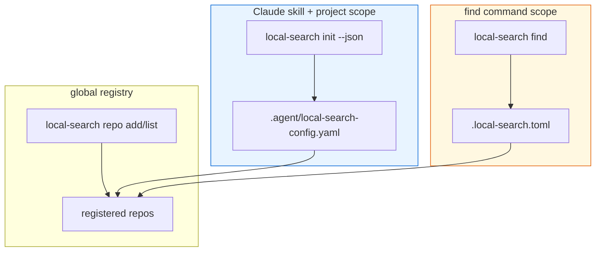
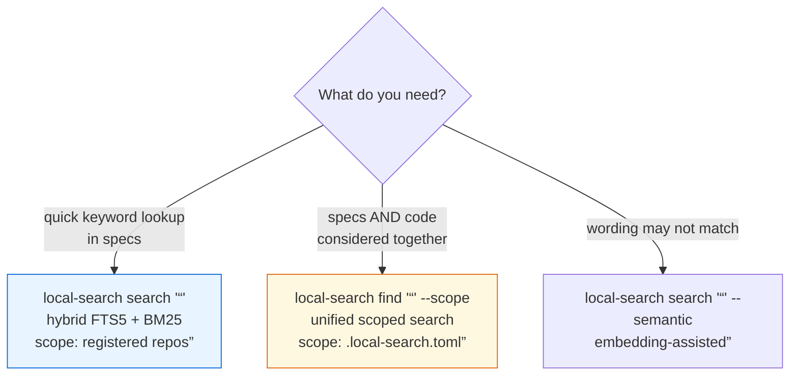
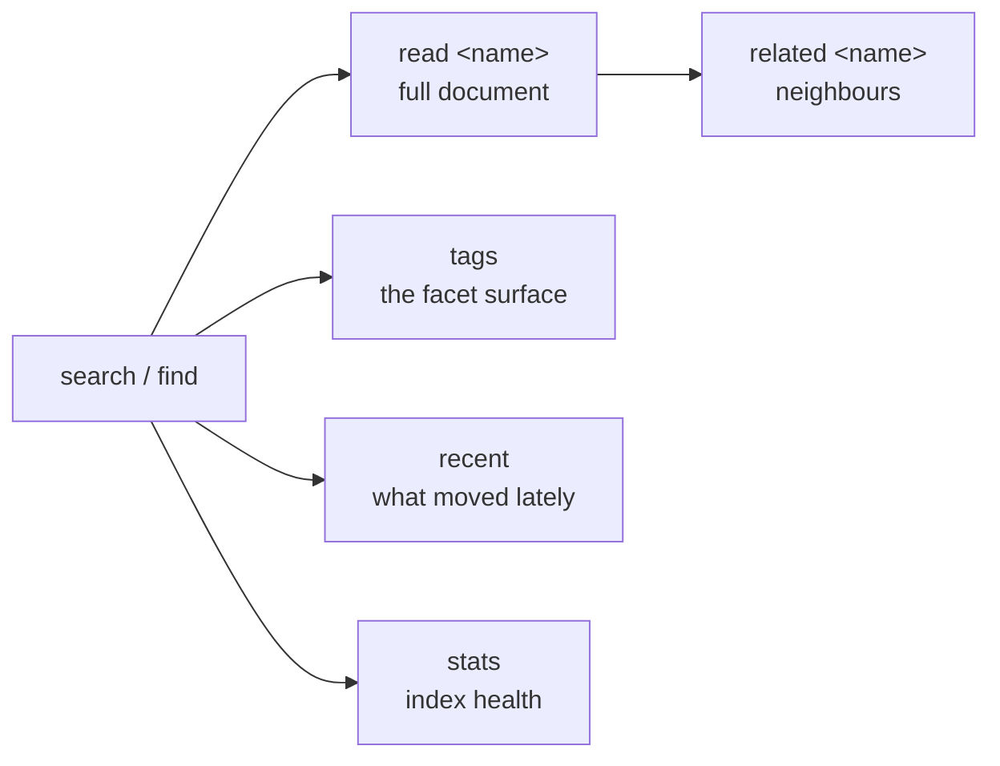
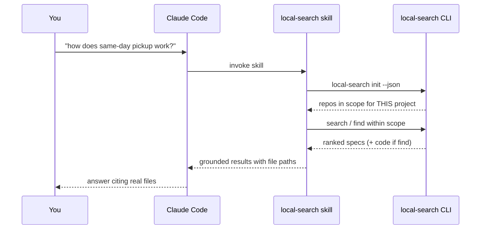
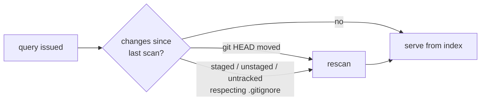

# Module 3 — Retrieving Context with Local Search

**Duration:** 20 minutes
**Source:** `local-search` docs — search, keeping the index fresh, and
configuration; verified against `local-search` **0.3.14**

---

## Module purpose

| | |
| --- | --- |
| **Why this module exists** | Modules 1–2 put valid context on disk. Now it has to be *findable* — across repos that share no system, with no server, in under a second. |
| **What participants leave with** | Working installs, registered repos, the `search`/`find` distinction, and the skill wired into their agent. |
| **How it is taught** | Every command run live against a real registered repo, with the tool's own output header read as a diagnostic. |

---

## Where this sits

From `.devlocal/local-context/context-retrieval-process.md`, Local Search
answers a specific class of question:

> **What does the platform do? Why does it behave this way?**

Not *how is it implemented* — that is Module 4. Keeping this boundary sharp is
what prevents participants from treating the two tools as competitors.


---

## Step 1 — Install

### Why

The install shape *is* the architecture argument from Module 1. Three
artifacts land, and none of them is a server.

### What

```bash
curl -fsSL https://raw.githubusercontent.com/metuur-ai/local-search/main/install.sh | bash
```

| Lands at | What it is |
| --- | --- |
| `~/.local/bin` | The CLI — a single Go binary, no runtime dependencies |
| `~/.claude/skills/local-search` | The Claude skill |
| `~/.local/share/local-search/web` | The web UI |

Under the hood: SQLite FTS5 with BM25 ranking. Offline, fast, no daemon.

> **Note — decoding "hybrid FTS5 + BM25"**
>
> The phrase appears in the command table below and in every result header
> (`[source=fts · rank=bm25 · repos=1 (0 with graphs)]`). It is three claims,
> not one.
>
> | Term | Question it answers | What it is |
> | --- | --- | --- |
> | **FTS5** | *Where did the match come from?* | SQLite's built-in Full-Text Search extension, v5. It keeps an **inverted index** — stemmed token → list of documents containing it — so a query is a lookup, not a scan. Because it lives inside SQLite, the whole index is one file on disk: this is what buys "offline, fast, no daemon". |
> | **BM25** | *Why is this result first?* | "Best Match 25", the relevance function FTS5 ranks with. Three signals: **term frequency with saturation** (the 10th "retry" counts far less than the 2nd — stuffing cannot win), **inverse document frequency** (rare terms outweigh common ones), **length normalisation** (a short doc that matches beats a long doc that mentions it in passing). |
> | **Hybrid** | *What else moved the order?* | Everything BM25 cannot see. The lexical score is blended with a **centrality boost** for docs well-connected in the code graph, **per-scope weights** so a spec outranks a derived artifact, and an **embedding score** when you pass `--semantic`. `repos=1 (0 with graphs)` is the tool admitting it had no graph signal for that query. |
>
> **Why a workshop audience needs this:** BM25 is purely lexical. It cannot
> retrieve a document that never uses your words, and it knows nothing about
> how the code is wired. That limit is not a bug to route around — it is
> precisely the seam Module 4 (Graphify) fills. Anyone who leaves believing
> "better ranking" would remove the need for a code graph has learned the
> wrong lesson.

### How

```bash
local-search version     # expect 0.3.14 or newer
```

**Two things to say out loud:**

1. **The web UI needs Node ≥ 18.** If Node is missing the installer skips that
   piece with a warning and everything else still works — you can add it later.
   Pre-built binaries are also on the project's GitHub releases if you would
   rather skip the script.
2. **There is no MCP server, and that is deliberate** — a CLI plus a Claude
   skill. This is Module 1's constraint honoured in the tooling: it works when
   MCP is unavailable, incompatible, or unauthorized.

> This module covers only how Local Search plugs into a documentation workflow.
> For the full command reference, architecture, and flags, go to
> [the project's own repo and README](https://github.com/metuur-ai/local-search).

---

## Step 2 — Register repositories

### Why

This is §6 of the strategy doc — *logical aggregation of distributed sources* —
made real. Registration is what turns N unrelated repos into one query surface
without moving, merging, or restructuring any of them.

### What

Local Search indexes whatever repos you register, auto-scanning just the folder
you point it at.



### How — demo

```bash
local-search repo add ~/moonbeam-os moonbeam-os
local-search repo list
local-search repo remove moonbeam-os     # surgical — touches nothing else in the index
```

Live output:

```text
NAME                  ADDED  LAST SCAN  LAST UPDATE  COMMIT    GRAPH
platform-example-repo 8d     7d         —            —         —
docs-workspace        7d     7d         9m           d6a799e   —
squirrel              6d     6d         5d           18d1075   graphify
foyer-platform        6d     6d         —            1133104   —
```

**Read the columns as instruments, not decoration:**

| Column | What it tells you | Module 1 link |
| --- | --- | --- |
| `LAST SCAN` | When the index last looked at disk | Failure case 2 |
| `LAST UPDATE` | When content last changed | Failure case 1 |
| `COMMIT` | Which revision you are querying | Reproducibility; failure case 4 |
| `GRAPH` | Whether a code graph exists for graph-aware ranking | Module 4 readiness |

Note `foyer-platform` points at `.../foyer-platform/docs` — you can register a
*subdirectory*. Register the documentation, not the source tree.

---

## Step 3 — Understand scope resolution

### Why

This is the single most confusing part of the tool, and the cause of "why is it
searching that repo?" There are **two different scope files**, read by
different commands. Teach it before the first surprise, not after.

### What



Before every query, the skill resolves which repos are in scope for the
*current* project by running `local-search init --json`.

### How — demo

```bash
local-search init --json
```

Live output from this repo:

```json
{
  "path": ".../.agent/local-search-config.yaml",
  "exists": true,
  "empty": true,
  "repositories": [],
  "available": [
    { "name": "foyer-platform", "path": ".../foyer-platform/docs", "spec_count": 120 },
    { "name": "squirrel",       "path": ".../squirrel",            "spec_count": 361 }
  ]
}
```

**Read this aloud:** `"repositories": []` with a populated `available` list
means *nothing is scoped for this project yet* — so every query searches
everything. That is not a bug, it is the default, and now you can see it.

Show participants how to read this **before** they go hunting for a config file
themselves. `reference/configuration.md` documents every file and env var both
tools read, side by side.

---

## Step 4 — `search` vs `find` — the trap

### Why

They look like aliases. They are not. Participants will use `search`, get no
code results, and conclude the tool is weak — when they wanted `find`.

### What



| Command | Searches | Scope file | Reach for it when |
| --- | --- | --- | --- |
| `search "<q>"` | Specs — hybrid FTS5 + graph-aware ranking | registered repos, `--repos` to narrow | Quick keyword lookup |
| `search "<q>" --semantic` | Specs, embedding-assisted | same | Your words ≠ the doc's words |
| `find "<q>" --scope <repo>` | **Specs and code graphs together** | `.local-search.toml` | You want both considered in one query |

### How — demo

```bash
local-search search "same-day pickup"
local-search search "same-day pickup" --repos moonbeam-os
local-search search "same-day pickup" --semantic
local-search find   "same-day pickup" --scope moonbeam-os
```

Illustrative — the header and result shape are exact, the paths depend on
which repos you registered:

```bash
$ local-search search "retry policy" --repos payments
[source=fts · rank=bm25 · repos=1 (0 with graphs)]

Specs (18):
  [payments · FTS] docs/sdd/notification-delivery.md
    Notification delivery and retry  ([authority/canonical])  .md
  [payments · FTS] docs/how-to/configure-backoff.md
    Configure retry backoff  .md
  [payments · FTS] specs/settlement-finality.md
    Settlement finality  .md
  ...
```

**Teach the header line — it is a diagnostic, not noise:**

```text
[source=fts · rank=bm25 · repos=1 (0 with graphs)]
```

| Field | Meaning |
| --- | --- |
| `source=fts` | Lexical path, not semantic — add `--semantic` to change it |
| `rank=bm25` | Ranking algorithm in play |
| `repos=1` | Your scope worked |
| `(0 with graphs)` | **No code graph available** — ranking had no structural signal |

That last field is the handoff to Module 4. Compare with `squirrel`, which
shows `graphify` in the `GRAPH` column and gets graph-aware ranking.

Also note the result annotation `([authority/canonical])` — document frontmatter
surfacing in search results. Local Search reads fields like `authority:` from
the file itself, so it can tell you a document is canonical because the
document declared it.

---

## Step 5 — Move past the first hit

### Why

A ranked list is a starting point. Retrieval is complete when you have the
document *and its neighbourhood* — most tasks need two or three related
artifacts, not one.

### What



| Command | Use |
| --- | --- |
| `local-search read <name>` | Pull the full document |
| `local-search related <name>` | Neighbours — the two or three you also needed |
| `local-search tags` | The facet surface (Module 2's derived tags, live) |
| `local-search recent` | What changed lately — orient on a repo you don't know |
| `local-search stats` | Index health — a Module 1 freshness check |

### How — demo

```bash
local-search read sync-a-knowledge-catalog
local-search related sync-a-knowledge-catalog
local-search tags
local-search recent
local-search stats
```

`local-search tags` is worth pausing on: those are the frontmatter tags you
wrote in Module 2, now serving as retrieval facets. The generation step and the
retrieval step meet here.

---

## Step 6 — Wire it into Claude

### Why

Everything so far was a human at a terminal. The point is an agent that
retrieves the same context, scoped the same way, before it answers.

### What

```bash
local-search install-skill --global    # any Claude Code session
local-search install-skill --local     # writes to ./.claude/skills
```

It **refuses to overwrite** an existing skill install unless you pass `--force`.



### How

Install the skill, then ask Claude Code a question about the workspace and
watch it resolve scope first. **The property to point at:** the agent's answers
are scoped exactly the same way your CLI is — no divergence between what you
can find and what it can find.

Global vs local: `--global` for repos you always work in; `--local` when a
project needs a specific scope that shouldn't leak into other sessions.

---

## Step 7 — Keep it fresh

### Why

Module 1, failure case 2: index older than disk. This is the one freshness
problem Local Search actually owns (§11), so it is the one it solves.

### What

Local Search auto-detects changes on every query:



Day-to-day editing of discovery briefs and PRDs just works — no manual step.

### How

For forcing a rescan, installing git hooks so it never goes stale, and scoping
which repos a given project searches, see
`how-to/keep-search-fresh.md`. For "no repos added yet," stale results, and a
corrupt index, see `reference/troubleshooting.md`.

**Restate the boundary:** auto-detection covers the *index vs. disk* gap. It
does **not** cover *disk vs. upstream* — that is Problem A, which no tool in
this workshop solves.

---

## Common questions

**"Why no MCP server?"**
A deliberate choice in favour of a CLI plus a Claude skill. It works when MCP is
unavailable, incompatible, or unauthorized — Module 1, Step 1.

**"`search` returned nothing useful."**
Check three things in order: (1) the header — did `repos=N` match your
intent? (2) is this a `find` question, i.e. do you need code considered? (3) try
`--semantic` if your vocabulary differs from the document's.

**"Do I register the repo or the docs folder?"**
Either. `foyer-platform` in the demo is registered at `.../foyer-platform/docs`.
Register the narrowest folder that contains what you search for.

**"Is this a RAG system?"**
It is a spec registry with FTS5 + BM25 and an optional semantic path. The
default is lexical and deterministic — same query, same pin, same results.

---

## Facilitator notes

- **Step 4 is the module's core.** The `search`/`find` confusion is the number
  one support question. Budget time to run both against the same query.
- **Read the header line every single time** you run a search on stage. By the
  third repetition participants will read it themselves.
- **If `init --json` shows `"repositories": []`** on your demo machine — good.
  Teach it as scope resolution rather than apologising for an empty config.
- **Timing:** Steps 1–2 can compress to three minutes if participants
  pre-installed. Do not compress Steps 3–4.

**Previous:** [Module 2 — Process to Generate Local Context](02-generate-local-context.md)
**Next:** [Module 4 — When to Reach for Graphify](04-graphify-retrieval.md)
