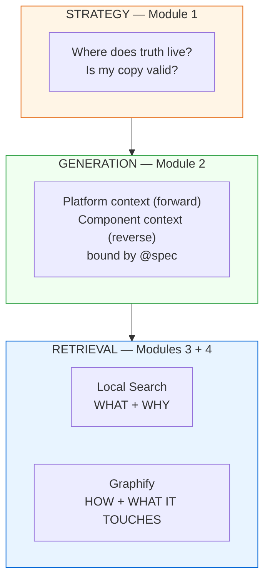
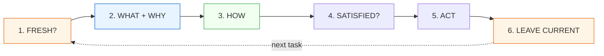

# Workshop — Local Context & Context Retrieval

**Date:** 2026-07-30
**Duration:** 70 minutes
**Audience:** engineers, product owners, tech leads who work with coding agents
**Format:** live demo — facilitator drives, participants follow on their own repo

---

## The modules

| # | Module | Time | Answers |
| --- | --- | --- | --- |
| 1 | [Local Context Strategy](01-local-context-strategy.md) | 15 min | Where does truth live, and is my copy valid? |
| 2 | [Process to Generate Local Context](02-generate-local-context.md) | 20 min | How does context get created, at two levels? |
| 3 | [Retrieving with Local Search](03-local-search-retrieval.md) | 20 min | What does the platform do, and why? |
| 4 | [When to Reach for Graphify](04-graphify-retrieval.md) | 15 min | How is it implemented, and what does it touch? |


---

## The one slide that frames everything

There are four things in this workshop and they are **not competitors**.
Everyone confuses them, so name the difference before touching a terminal.



From `.devlocal/local-context/context-retrieval-process.md`:

> The Context Retrieval Process describes the **complete flow rather than a
> specific technology**. Local Search and Graphify are complementary, not
> alternatives — Graphify does not replace Local Search.

**Facilitator note:** if participants leave believing *"Graphify is a better
grep"* or *"Local Search is a worse RAG"*, the workshop failed. The point is the
**order** of the four moves.

---

## Pre-flight (10 min, before the room fills)

```bash
# 1. Verify tools
local-search version          # expect 0.3.14 or newer
graphify --version            # expect 0.9.26 or newer

# 2. Install anything missing
curl -fsSL https://raw.githubusercontent.com/metuur-ai/local-search/main/install.sh | bash

# 3. Pre-build the Graphify demo graph — do NOT run this on stage
cd <demo-repo> && graphify .
```

**Fallback if the network is hostile:** pre-built binaries are on each project's
GitHub releases page. Put them on a USB stick. A workshop that dies at `curl` is
a wasted 90 minutes.

---

## The retrieval sequence — the handout

This is the workshop in six lines. Print it.

```text
1. Is my context fresh?        local-search repo list      (check LAST SCAN / COMMIT)
                               git status in the source repo

2. What & why?                 local-search search "<question>"
                               local-search find "<q>" --scope <repo>   (specs + code)

3. How is it built?            graphify-out/GRAPH_REPORT.md             (architecture FIRST)
                               graphify explain / path / query

4. Is it satisfied?            grep -rn "@spec req://<platform>/<req>" .

5. Act.

6. Leave it current.           graphify update .          (after code changes)
                               re-run the tag derive step (after frontmatter changes)
```



**Closing line:** your document structure *organizes* knowledge; the Context
Retrieval Process is the *mechanism* that finds it and puts it into context to
solve a task.

---

## The through-line

The workshop is one argument, not four tool demos. Module 1 opens the problems;
be explicit about which ones the tooling actually closes and which ones stay
with the humans in the room.

| Module 1 raises | Closed by |
| --- | --- |
| Failure case 2 — index older than copy | Module 3, Step 7 — auto-rescan |
| Failure case 1 — copy older than source | A pinned, committed sync layer **you** own |
| Failure case 3 — partial sync | A lock file recording the resolved slice set |
| Failure case 4 — wrong branch | Explicit committed pins, never a floating branch |
| Failure case 5 — no provenance | A manifest — the manifest *is* the provenance |
| §12 — "we need a synchronization layer" | Not a tool. A decision to build one. |
| Problem B — upstream doc is simply wrong | **Nothing.** Say so. It is human discipline. |

Only the first row is demonstrated live. The rest are requirements the workshop
hands back to the team, and saying that plainly is the point — a room that
leaves thinking a tool solved staleness for them has learned the wrong lesson.

Module 4 raises one more, and it closes backwards:

| Module 4 raises | Closed by |
| --- | --- |
| "Graphify knows what the code *is*, not what it was *supposed to* be" | Module 2 — the written record plus `@spec` markers |

---

## Cut-list if you run long

Module 2 overruns. In order of what to drop first:

1. Module 2, Step 2 (full discovery→PRD lifecycle walk-through)
2. Module 2, Step 5 (tag composition)
3. Module 4, Step 3 (`GRAPH_REPORT.md` read)
4. Module 3, Steps 1–2 (if participants pre-installed)

**Must survive, whatever happens:**

- Module 1, Steps 4–6 — staleness, the seven states, responsibility split
- Module 2, Step 4 — the `@spec` grep demo
- Module 3, Step 4 — `search` vs `find`
- Module 4, Step 5 — EXTRACTED vs INFERRED

---

## Facilitator crib sheet

**Questions you will get:**

- *"Why not just use MCP?"* — Availability, compatibility, permissions,
  authentication. MCP is an **acquisition** mechanism; local is the **query**
  mechanism. Local Search ships no MCP server on purpose.
- *"Isn't Graphify just a smarter grep?"* — Grep finds strings. Graphify
  traverses EXTRACTED + INFERRED edges and labels which is which.
- *"Can I edit a synced doc copy?"* — No. Make it read-only and fix upstream;
  an editable copy stops being a copy.
- *"Do I need to write tags?"* — Never. Set frontmatter, re-run the derive step.
- *"Where do code repos fit in the doc model?"* — They don't, deliberately. The
  only binding is grep-able `@spec` markers in tests.

**Failure modes to rehearse:**

- No `graphify-out/` in the demo repo → use a repo showing `GRAPH = graphify`
  in `local-search repo list`, or build during the break. Never on stage.
- `local-search init --json` shows `"repositories": []` → expected on a fresh
  project. Teach it as scope resolution, don't apologise for it.
- Web UI missing → Node < 18. Say so and move on; the CLI is the demo.

**The demo that must be run as a failure, not a success:**

Closing a PRD **before** updating the reality doc (Module 2, Step 2). A passing
demo teaches syntax. A refusing demo teaches the invariant.

---

## Sources

Everything in these modules is grounded in files in this repo or in verified
live tool output.

| Topic | Source |
| --- | --- |
| Local context strategy, staleness, sync states | `.devlocal/local-context/local-context-strategy.md` |
| MCP constraint, local availability | `.devlocal/local-context/local-context-process-01.md`, `local-context-01.md` |
| Two-level context model | `.devlocal/local-context/local-context-02.md` |
| Retrieval process framing | `.devlocal/local-context/context-retrieval-process.md` |
| Local Search workflow | `docs/user-guide/tutorials/03-search-your-workspace.md` |
| IDs, tags, `@spec` | `docs/ONTOLOGY-GUIDE.md` |
| Real `@spec` markers | `examples/banking/bank/repos/code-transaction-screening/tests/test_settlement_finality.py` |
| Graphify usage rules | `~/.claude/CLAUDE.md`, project `CLAUDE.md` |

Tool versions verified in this environment: `local-search 0.3.14`,
`graphify 0.9.26`.

**Single-file version of this workshop:**
[`../2026-07-30-context-retrieval-workshop-demo.md`](../2026-07-30-context-retrieval-workshop-demo.md)
